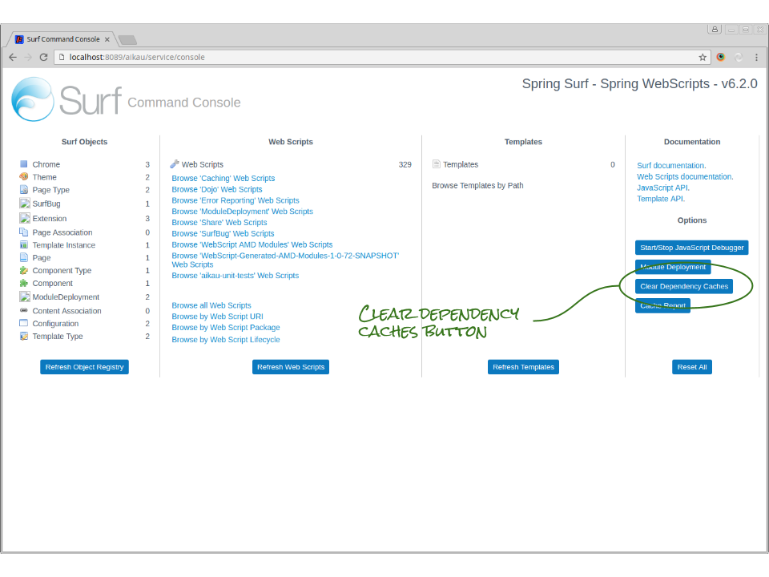

## Clearing Dependency Caches

### Background Information
Aikau runs on [Surf](http://docs.alfresco.com/5.0/concepts/surf-fwork-intro.html "Link to Alfresco documentation") (which is is an extension to the [Spring MVC framework](http://docs.spring.io/spring/docs/current/spring-framework-reference/html/mvc.html "Link to Spring documentation").

Surf aggressively caches as much information as it can for every Aikau page that it serves and generates unique JavaScript and CSS resources for each page that are given the name of an MD5 checksum generated from their contents. This allows the resources to have an infinite expiry time since any changes to the contents of those file will result in a new file being generated which the browser will be forced to download. This ensures that the browser cache cannot become stale and that hot-deployed updates will be loaded on the next request.

Generating JavaScript and CSS resources ensures that only the required code is loaded onto each page by the minimum number of HTTP requests in order to enhance performanance. From a developers point of view it means that steps must be taken in order for a browser to be served updates as they are made.

You can either manually clear the Surf caches as you make changes or completely disable caching (and accept a deterioation in page performance during development as a result).

### Clearing Dependency Caches

##### Step 1.
In your browser, open the page [http://localhost:8090/aikau-sample/service/console](http://localhost:8090/aikau-sample/service/console). You should see the following page:


##### Step 2.
Click the button marked "Clear Dependency Caches" to empty the Surf caches. The next time you load a page Surf will generate a new file containing any code changes that you have made.

### Disabling Caches
In the `<PROJECT-HOME>/src/main/webapp/WEB-INF/surf.xml` you will find a section of configuration that looks like this:

```XML
<!-- This option should ONLY be set to true during development. In production this will need to be reset to 
     false to ensure optimum performance -->
<disable-resource-caching>false</disable-resource-caching>
```

Change the value from `false` to `true` and after restarting the server Surf will clear its caches before serving every page request (effectively disabling them).
