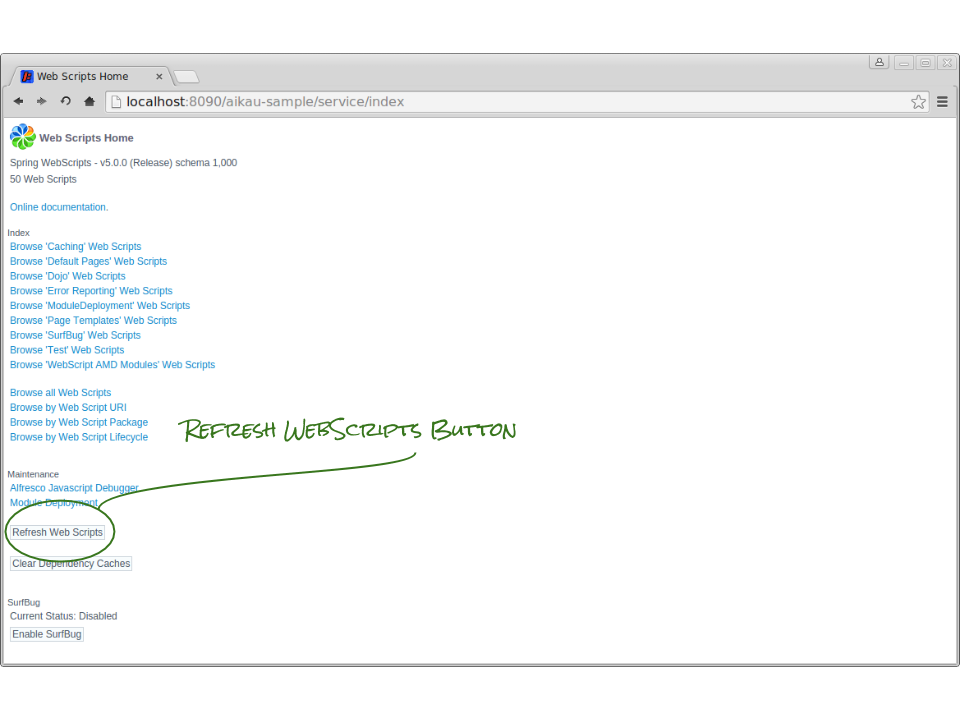

## Refreshing WebScripts

### Debug Mode
When running in "client-debug" mode (as your client is initially configured to do) it will only be necessary to refresh your WebScript files when ading an entirely new WebScript (e.g. if you're adding files that didn't exist when the server first started). There are a few occasions when you will be prompted to do this throughout the course of the tutorial.

##### Step 1
In your browser, open the page [http://localhost:8090/aikau-sample/service/index](http://localhost:8090/aikau-sample/service/index). You should see the following page:

##### Step 2
Click the button marked "Refresh Web Scripts" to reload the existing WebScripts and load any new WebScripts that you might have added since the server started.

### Production Mode
When running in production mode it will be necessary to refresh your WebScripts if you make any changes to them in order to see the effect of those changes.
