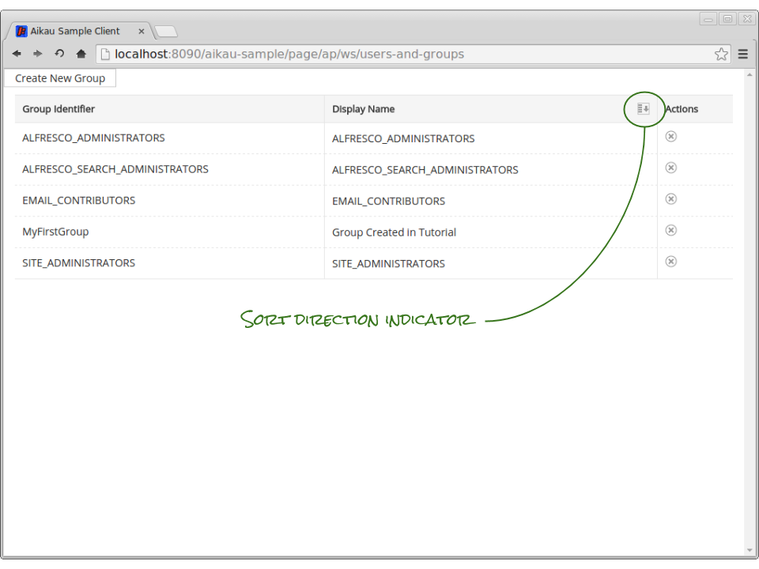
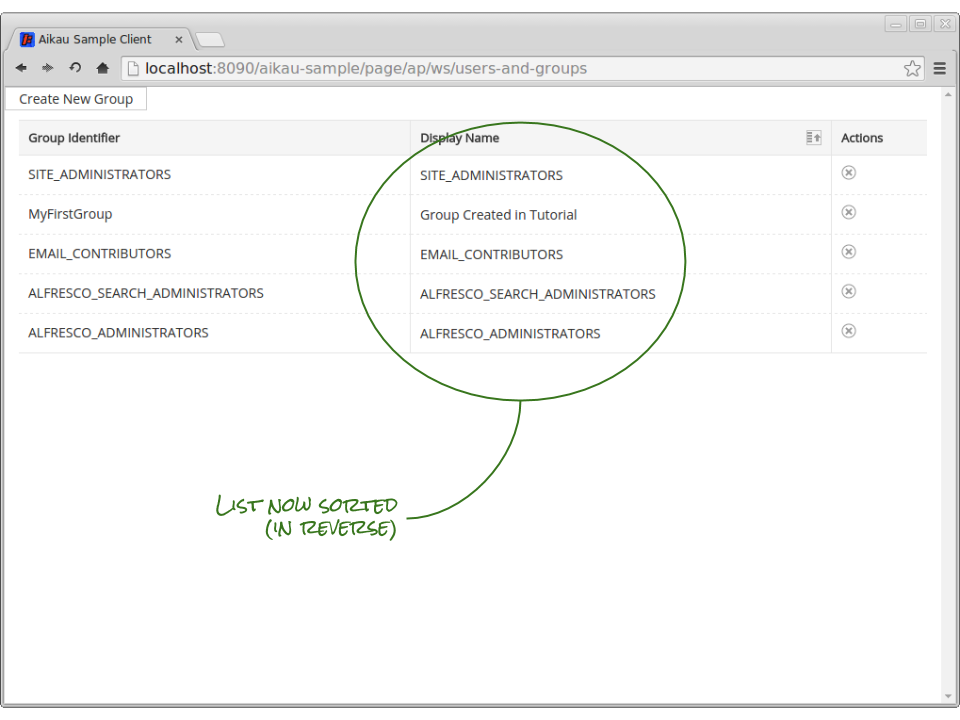
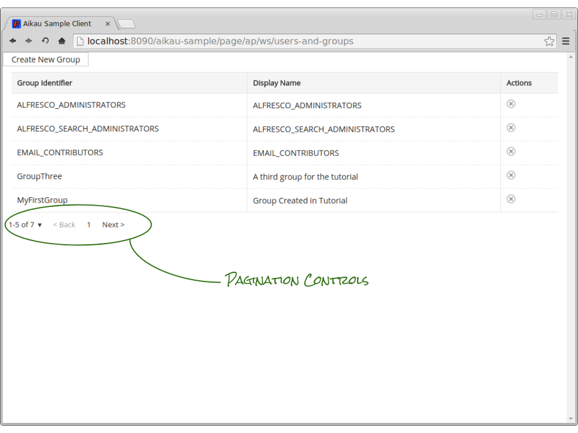
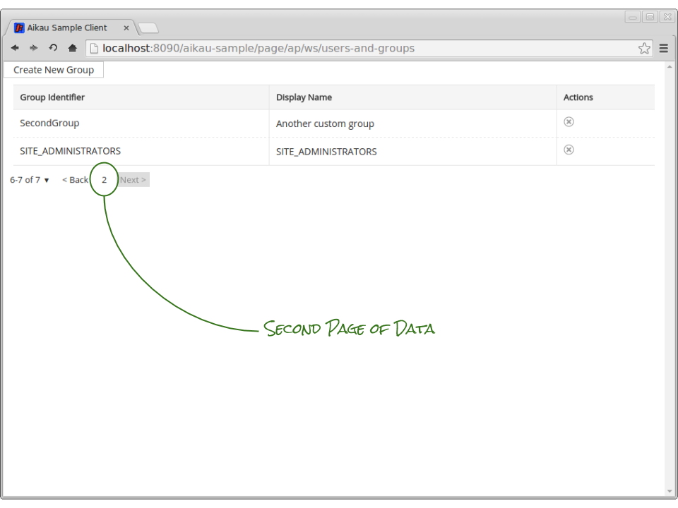

Previous: [Inline Editing Properties](./Tutorial10.md),
Next: [Introducing Menus](./Tutorial12.md)

## Tutorial 11 - Sorting and Pagination

The API that we’re using for retrieving group data supports both pagination and sort request parameters. Let’s leverage those capabilities with some updates to our page model.

### Step 1 - Switching List Widgets
The first thing that we need to do is to convert our `alfresco/lists/AlfList` into an `alfresco/lists/AlfSortablePaginatedList`. This simply requires changing the `name` attribute in our page model. Since they are both in the same module hierarchy the current configuration will work exactly as before.

We can also configure our `alfresco/lists/views/layouts/HeaderCell` widgets to allow reordering the list by setting the `sortable` attribute to true and then providing a value to sort on.

Update the HeaderCell for the group display name column to look like this:

```JAVASCRIPT
{
   name: "alfresco/lists/views/layouts/HeaderCell",
   config: {
      label: "Display Name",
      sortable: true,
      sortValue: "displayName"
   }
},
```

When you refresh the page you will be able to click on the display name header cell and you will see a sort icon displayed. Clicking again will change the icon to indicate that the sort direction has changed.



You should also note however that the list doesn’t change - the list reloads but the order remains the same. This is another limitation of using the CrudService to retrieve our data because the sort information is defined directly within the URL that has been configured.

We now need to update our UserAndGroupService module to support requests for listing group data and to take sort field and direction into account.

### Step 2 - Service Updates
Update the service to include the following function:

```JAVASCRIPT
getGroups: function tutorial_UserAndGroupService__getGroups(payload) {
  var alfTopic = 
    (payload.alfResponseTopic != null) ? payload.alfResponseTopic : "";

  var sortDir = 
    (payload.sortAscending != null && payload.sortAscending === true) ? "asc" : "desc";

  var sortField = 
    (payload.sortField != null) ? payload.sortField : "shortName";

  this.serviceXhr({
    url: AlfConstants.PROXY_URI + "api/groups?dir=" + sortDir + "&sortBy=" + sortField + "&zone=APP.DEFAULT&maxItems=50&skipCount=0",
    method: "GET",
    alfTopic: alfTopic
  });
},
```

...and update the constructor to bind the subscription to the function with the line:

```JAVASCRIPT
this.alfSubscribe("TUTORIAL_GET_GROUPS", lang.hitch(this, this.getGroups));
```

The new `getGroups` function is inspecting the published payload and constructing a URL containing the appropriate request parameters based on the `sortAscending` and `sortField` attributes.

The other important line to be aware of is the assignment of the `alfTopic` variable that is then included in the call to the `serviceXhr` function. If you call `serviceXhr` without any callbacks configuration then it will publish the XHR response as the payload of a topic based on a supplied `alfTopic` attribute.

### Step 3 - Further Model Updates
There’s a couple of things to do before testing everything out. The first is to change the `loadDataPublishTopic` for the AlfSortablePaginatedList to the topic we just created “TUTORIAL_GET_GROUPS”, and remove the `loadDataPublishPayload`. Secondly we need to override the default `sortField` attribute in our AlfSortablePaginatedList. If this isn’t overridden the default `sortField` of `cm:name` will be used (this is the default because it is expected that most lists will be dealing with Alfresco document nodes which will have this property). Update the page model to set the new topic and the sortField to `shortName` as the default:

```JAVASCRIPT
{
  name: "alfresco/lists/AlfSortablePaginatedList",
  config: {
    loadDataPublishTopic: "TUTORIAL_GET_GROUPS",
    itemsProperty: "data",
    sortField: "shortName",
    widgets: [
```

When you [clear the dependency caches](./ClearingDependencyCaches.md) and refresh the page you’ll now be able to click on the “Display Name”  header cell to change the order of the listed groups.



You can also update the “Group Identifier” header cell to allow sorting to be done against the identifier as well:

```JAVASCRIPT
{
   name: "alfresco/lists/views/layouts/HeaderCell",
   config: {
      label: "Group Identifier",
      sortable: true,
      sortValue: "shortName"
   }
},
```

When you refresh the page you’ll be able to sort on either the group identifier or the display name and change the order of the resulting list.

### Step 4 - Pagination
As you’d expect from its name, the `alfresco/lists/AlfSortablePaginatedList` module also provides support for paged data. The main requirement is actually to update the model to include a widget that allows the user to control pagination.

The `alfresco/lists/Paginator` is one such widget (although it’s important to realise that as all communication is done over a publication/subscription you’re not constrained in any way to using this widget - the AlfSortablePaginatedList only cares about the topic, not its origin!)

Update the page model so that after the group AlfSortablePaginatedList the following widget definition is added:

```JAVASCRIPT
{
  name: "alfresco/lists/Paginator",
  config: {
    documentsPerPage: 5,
    pageSizes: [5,10,20]
  }
}
```

The default number of results per page is 25, and it’s unlikely that you’ve created that many groups so in order to see pagination in action we’re overriding the default to only display 5 results in each page of data. If you’re currently only seeing 5 (or fewer) groups in the list then create a couple more so that you can test pagination!

We're also changing the default page sizes configuration (which would normally be 25,50,75 & 100) to a more suitable set for this example.

We also need to make some updates to the AlfSortablePaginatedList configuration to map it against the data that it will receive (an alternative approach would be to add a callback in our service that normalizes the response to fit the defaults). Add the following to the configuration:


```JAVASCRIPT
currentPageSize: 5,
startIndexProperty: "paging.skipCount",
totalResultsProperty: "paging.totalItems",
```

Here we’re also setting the current page size to show 5 results per page and we’re also identifying the properties in the XHR response that identify the requested starting index of data and the total number of results. This information is published whenever data is loaded and widgets like the Paginator are able to process this data to update their rendering.

The last update we need to make is to the `getGroups` function in our service so that it will include the page and page size data in the request URL:

```JAVASCRIPT
getGroups: function tutorial_UserAndGroupService__getGroups(payload) {
  var alfTopic = 
    (payload.alfResponseTopic != null) ? payload.alfResponseTopic : "";

  var sortDir = 
    (payload.sortAscending != null && payload.sortAscending === true) ? "asc" : "desc";

  var sortField = 
    (payload.sortField != null) ? payload.sortField : "shortName";

  var pageNo = (payload.page != null) ? payload.page : 1;
  var pageSize = (payload.pageSize != null) ? payload.pageSize: 25;
  var skipCount = (pageNo - 1) * pageSize;

  this.serviceXhr({
    url: AlfConstants.PROXY_URI + "api/groups?dir=" + sortDir + 
         "&sortBy=" + sortField + 
         "&zone=APP.DEFAULT&maxItems=" + pageSize + 
         "&skipCount=" + skipCount,
    method: "GET",
    alfTopic: alfTopic
  });
},
```

When you [clear the dependency caches](./ClearingDependencyCaches.md) and refresh the page you will now find that you can page through all your groups (assuming that you have more than 5 of course!)




Previous: [Inline Editing Properties](./Tutorial10.md),
Next: [Introducing Menus](./Tutorial12.md)
