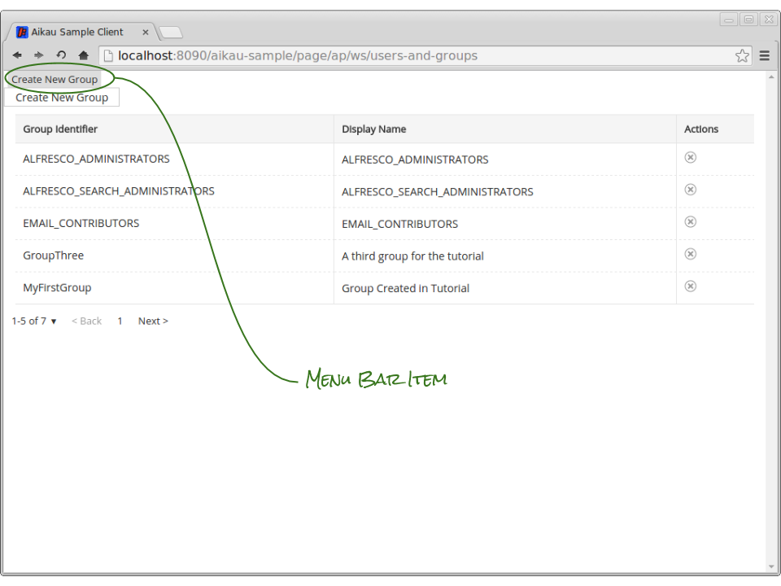
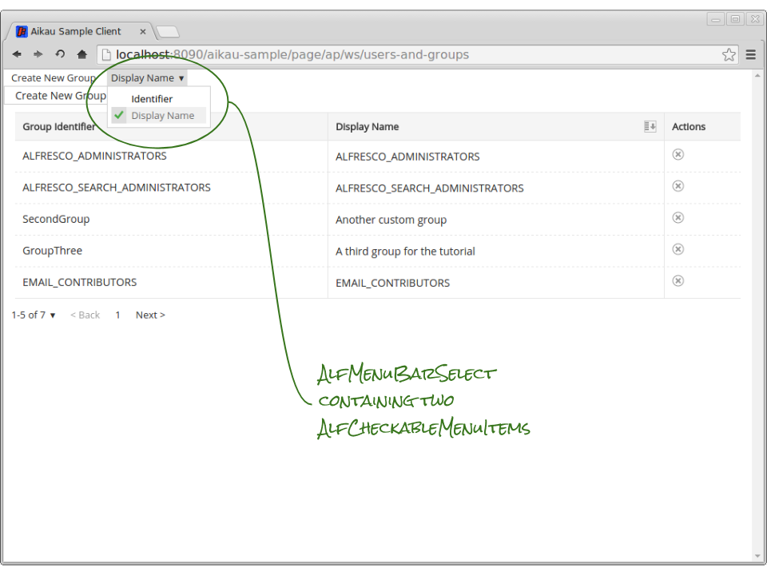
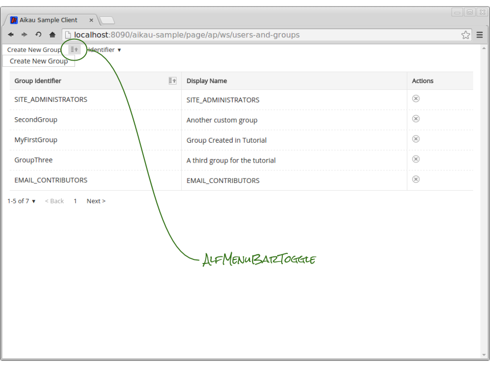
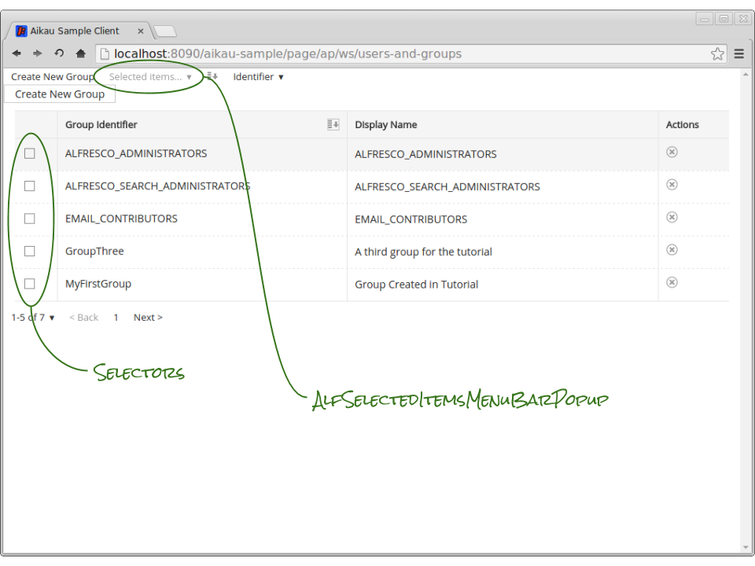
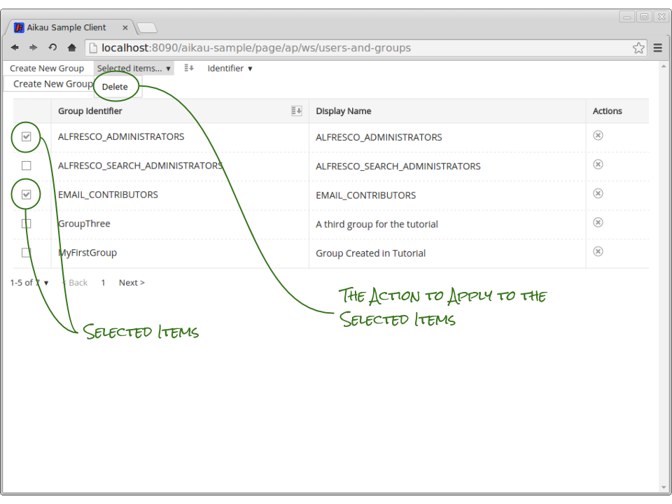
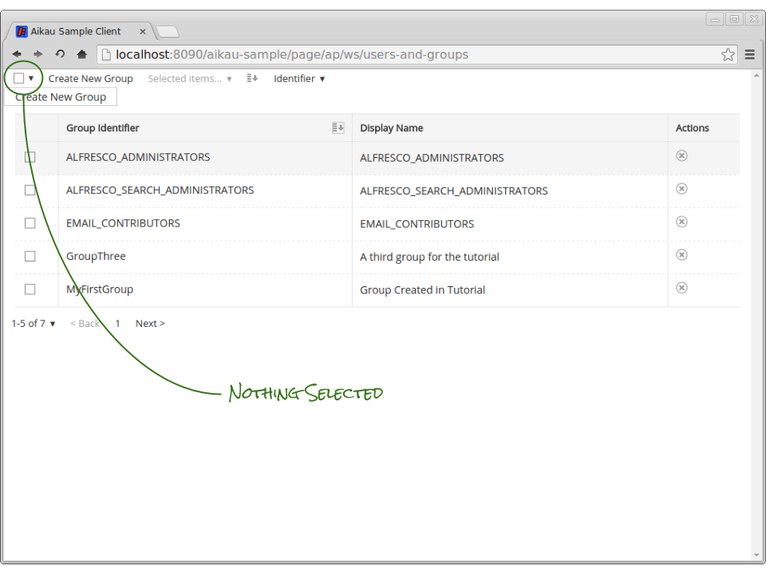
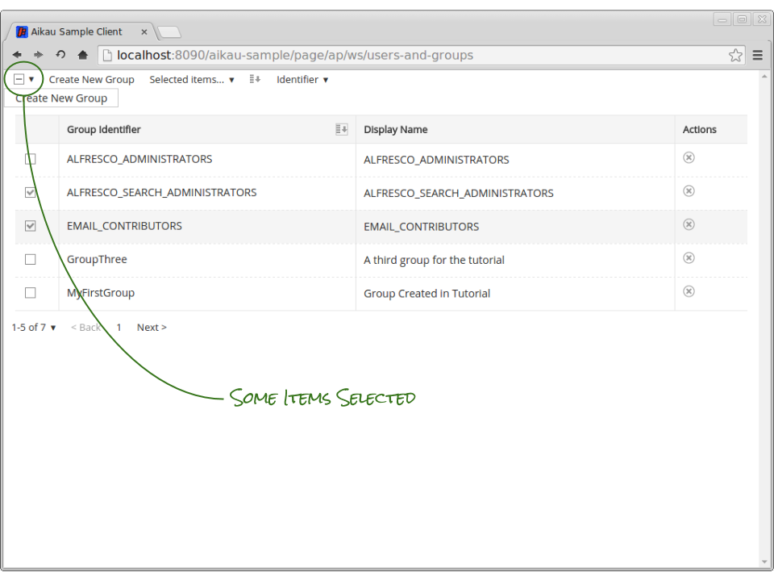
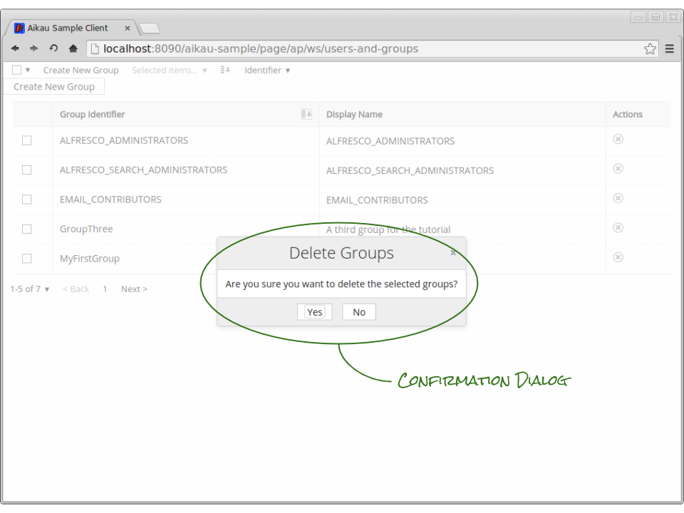
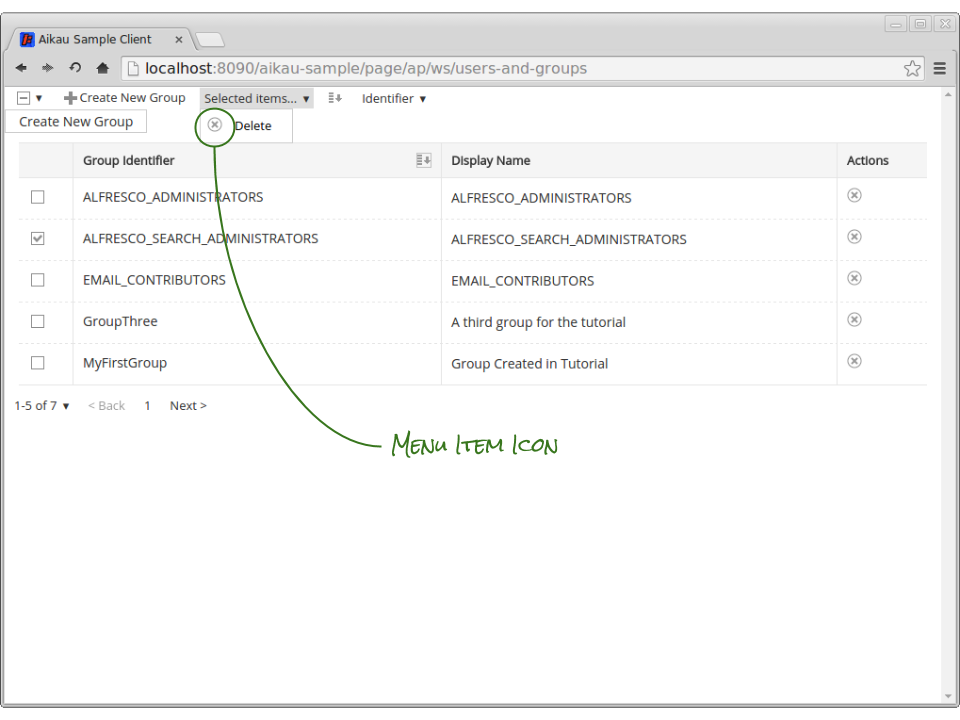

Previous: [Sorting and Pagination](./Tutorial11.md),
Next: [Introducing Layout](./Tutorial13.md)

## Tutorial 12 - Introducing Menus

In this tutorial we’re going to introduce some of the menu widgets and use them to demonstrate alternative approaches to tackling some of the user interactions that we’ve implemented so far.

### Step 1 - Create Group Menu Item
The root of all menu widgets is the `alfresco/menus/AlfMenuBar` into which you can add a variety of different menu widgets. Let’s add a menu bar and also add an `alfresco/menus/AlfMenuBarItem` to perform the create group action. Add the following to your page model before the `alfresco/buttons/AlfButton`:

```JAVASCRIPT
{
  name: "alfresco/menus/AlfMenuBar",
  config: {
    widgets: [
      {
        name: "alfresco/menus/AlfMenuBarItem",
        config: {
        }
      }
    ]
  }
}
```
         
Copy the content of `config` object from the `alfresco/buttons/AlfButton` and paste it into the `config` object of the `alfresco/menus/AlfMenuBarItem` (as it is going to do publish the same payload on the same topic as the button).

When you refresh the page and click the “Create New Group” menu item you’ll find that (unsurprisingly) it allows you to create a group as you could by clicking on the button. You can remove the original AlfButton now if you like.



### Step 2 - Sort field menu
We can now do something similar to provide an alternative approach to setting the sort field. This time we’re going to create a popup menu bar item that allows us to choose the field to sort the group data on. Add the following after the `alfresco/menus/AlfMenuBarItem` that you just added:

```JAVASCRIPT
{
   name: "alfresco/menus/AlfMenuBarSelect",
   config: {
      title: "Sort By",
      selectionTopic: "ALF_DOCLIST_SORT",
      widgets: [
         {
            name: "alfresco/menus/AlfMenuGroup",
            config: {
               widgets: [
                  {
                     name: "alfresco/menus/AlfCheckableMenuItem",
                     config: {
                        label: "Identifier",
                        title: "Sort By Group Identifier",
                        value: "shortName",
                        group: "GROUP_SORT_FIELDS",
                        publishTopic: "ALF_DOCLIST_SORT",
                        checked: true,
                        publishPayload: {
                           label: "Identifier",
                           direction: "ascending",
                           sortable: true
                        }
                     }
                  },
                  {
                     name: "alfresco/menus/AlfCheckableMenuItem",
                     config: {
                        label: "Display Name",
                        title: "Sort By Display Name",
                        value: "displayName",
                        group: "GROUP_SORT_FIELDS",
                        publishTopic: "ALF_DOCLIST_SORT_FIELD_SELECTION",
                        checked: false,
                        publishPayload: {
                           label: "Display Name",
                           direction: "ascending",
                           sortable: true
                        }
                     }
                  }
               ]
            }
         }
      ]
   }
}
```

There are 3 types of menu widgets that we’re using. The first is the `alfresco/menus/AlfMenuBarSelect` that occupies a space on the menu bar. This widget is a special popup menu that has a label that is set via publication. In this case it is subscribing to the “ALF_DOCLIST_SORT_FIELD_SELECTION” that is published by one of the widgets that it contains.

The `alfresco/menus/AlfMenuGroup` widget is not essential in this model but allows menu item widgets to be grouped together and can be given an optional title (which we’ve omitted here:  try adding a `label` attribute to its configuration and see what happens!)

Finally we have two `alfresco/menus/AlfCheckableMenuItem` widgets that represent the two available fields that can be sorted on. This is a special type of menu item that can be grouped together via the `group` attribute so that only one widget within the group can be selected at any one time.

When one of these items is clicked you’ll see that it has a “tick” icon placed next to it to indicate that it is the selected item in the group. It also publishes on the configured publication topic (that the `alfresco/menus/AlfMenuBarSelect` subscribes to) with a payload containing the configured payload with the `value` attribute mixed in. 

If you refresh the page and try this out you’ll see that the label of the `alfresco/menus/AlfMenuBarSelect` changes as you click on the `alfresco/menus/AlfCheckableMenuItem`. You should also notice that clicking on the un-selected menu item will both select it and deselect the other.

Finally and most importantly you should notice that changing the sort field by the menu will also update the header cell icons to indicate the column that is being sorted on. This is another benefit of using publication/subscription communication - we get this behaviour for free by virtue of using the widgets being configured to use the same topic.

Also, in case you were wondering - the difference between the `label` and `title` attributes is that the `title` attribute is for accessibility configuration. This is the value that will be used for the alternative text that is picked up by screen readers.



### Step 3 - Sort Direction Toggle
We can also add a menu item to handle changing the sorted direction. There are only two states of direction (ascending and descending) so this is a good candidate for the `alfresco/menus/AlfMenuBarToggle` widget.

Add the following to the page model before the `alfresco/menus/AlfMenuBarSelect`:

```JAVASCRIPT
{
   name: "alfresco/menus/AlfMenuBarToggle",
   config: {
      subscriptionTopic: "ALF_DOCLIST_SORT",
      subscriptionAttribute: "direction",
      checkedValue: "ascending",
      checked: true,
      onConfig: {
         title: "Change sort order to descending",
         iconClass: "alf-sort-ascending-icon",
         iconAltText: "Sorted ascending",
         publishTopic: "ALF_DOCLIST_SORT",
         publishPayload: {
            direction: "ascending"
         }
      },
      offConfig: {
         title: "Change sort order to ascending",
         iconClass: "alf-sort-descending-icon",
         iconAltText: "Sorted descending",
         publishTopic: "ALF_DOCLIST_SORT",
         publishPayload: {
            direction: "descending"
         }
      }
   }
}
```

This widget allows the configuration of “on” and “off” states. They are configured with publication topic and payloads that will be published when clicked. One thing to notice is that the instruction text that is included in the `title` attribute is the opposite of the current state, e.g. when toggled off the `title` attribute should indicate what will indicate what would happen when toggled on.

Refresh the page and try it out. Once again you should see that toggling the sort direction will also update the header cell icon for the currently sorted column.



### Step 4 - Multiple Item Selection
If you want to perform an action on more than one item (at the moment our page only supports delete, but other pages might support all kinds of other actions) then you will want to allow items in the list to be selected and then perform an action on all those items. 

To add the ability to select items we’re going to need to add the `alfresco/renderers/Selector` to our `alfresco/lists/views/AlfListView`. This renderer will add a check box which when selected will publish the `currentItem` attribute for that row.

Add a new header cell as the first entry in the `widgetsForHeader` attribute, e.g:

```JAVASCRIPT
{
   name: "alfresco/lists/views/layouts/HeaderCell",
   config: {
      label: ""
   }
},
```

The label has been configured to be an empty string here in order to keep the column narrow, but you could add a label if you would prefer.

Add the selector widget as the first entry in the `widgets` attribute of the `alfresco/lists/views/layouts/Row` as follows:

```JAVASCRIPT
widgets: [
  {
    name: "alfresco/lists/views/layouts/Row",
      config: {
        widgets: [
          {
            name: "alfresco/lists/views/layouts/Cell",
            config: {
              additionalCssClasses: "mediumpad",
              widgets: [
                {
                  name: "alfresco/renderers/Selector"
                }
              ]
            }
          },
```

Now we need to add in a menu widget that will subscribe to the item selection publications. Add the following as the second entry in the `alfresco/menus/AlfMenuBar` widgets array:

```JAVASCRIPT
{
   name: "alfresco/documentlibrary/AlfSelectedItemsMenuBarPopup",
   config: {
      passive: false,
      itemKeyProperty: "shortName",
      label: "Selected items...",
      widgets: [
         {
            name: "alfresco/menus/AlfMenuGroup",
            config: {
               widgets: [
                  {
                     name: "alfresco/menus/AlfSelectedItemsMenuItem",
                     config: {
                        label: "Delete",
                        clearSelectedItemsOnClick: true,
                        publishTopic: "TUTORIAL_DELETE_GROUPS"
                     }
                  }
               ]
            }
         }
      ]
   }
},
```

The root `alfresco/documentlibrary/AlfSelectedItemsMenuBarPopup` widget subscribes to the topic published when items are selected. By default it does not keep track of the items that are selected and instead relies on publications from other widgets, but setting the `passive` attribute to `false` configures it to subscribe to individual item selection topics and publish on another topic containing the currently selected items.

It is to this latter topic that the `alfresco/menus/AlfSelectedItemsMenuItem` widget subscribes in order to update the publication payload with the details of the selected items. In this example when the “Delete” menu item is clicked a payload will be published on the “TUTORIAL_DELETE_GROUPS” topic containing the details of all the selected groups.

Refresh the page and try it out… although clicking the delete menu won’t currently do anything (because we still need to update our service to handle it!) you should notice that the popup menu itself is automatically disabled when no items are selected.



When you use the menu item you should also notice that all group selections are cleared. This is achieved by setting `clearSelectedItemsOnClick` to `true` as this instructs the menu item to publish a request to clear selections. This is not the default behaviour but makes sense in this instance because deleting the groups will want to remove them from the list of selected items.



### Step 5 - Select All, Select None
To save our user the trouble of individually clicking on each of the checkboxes when they want to delete everything (although we should remember that it’s not advisable to delete all the groups - especially the “ALFRESCO_ADMINISTRATORS” group!) we can add another widget to assist them.

Add the following as the first widget in the `alfresco/menus/AlfMenuBar`:

```JAVASCRIPT
{
   name: "alfresco/documentlibrary/AlfSelectDocumentListItems"
},
```

When you refresh the page you’ll see a new widget that also subscribes to the item selection publications in order to update its icon to indicate whether all, some or no items are selected. Clicking on that icon also allow you to cycle through the selection items (e.g. clicking on the icon when no items are selected will result in all items being selected).

You can also click on the down arrow to display a popup menu that allows you to perform the same action as well as inverting the current selection.





### Step 6 - Handling Bulk Actions
Now that we can select multiple groups we need to update our service to be able to handle requests to delete multiple items in a single action. Update the `UserAndGroupService.js` to add the following functions:

```JAVASCRIPT
deleteGroups: function tutorial_UserAndGroupService__deleteGroups(payload) {
  var groupsToDelete = payload.selectedItems;
  if (groupsToDelete != null)
  {
    array.forEach(groupsToDelete, lang.hitch(this, this.deleteGroup));
  }
},

deleteGroup: function tutorial_UserAndGroupService__deleteGroup(payload) {
  this.serviceXhr({
  url: AlfConstants.PROXY_URI + "api/groups/" + payload.shortName,
    method: "DELETE",
    data: {
      pubSubScope: payload.pubSubScope
    },
    successCallback: this.onSuccess,
    callbackScope: this
  });
},
```

We’re using a new Dojo utility function here [array.forEach](http://dojotoolkit.org/reference-guide/1.10/dojo/_base/array.html#foreach "Link to Dojo documentation"). We need to include it as an additional dependency and we need to update our `define` call to include it… update it to look like this:

```JAVASCRIPT
define(["dojo/_base/declare",
        "alfresco/core/Core",
        "dojo/_base/lang",
        "alfresco/core/CoreXhr",
        "service/constants/Default",
        "dojo/_base/array"],
        function(declare, Core, lang, CoreXhr, AlfConstants, array) {
```

**NOTE - This utility function is a polyfill for the [“forEach”](https://developer.mozilla.org/en-US/docs/Web/JavaScript/Reference/Global_Objects/Array/forEach "Link to Mozilla Documentation") function that was included in the ES5 specification so isn’t supported in IE8. If you don’t need to support IE8 then you should use the native browser function (if you don’t understand much of this paragraph, then don’t worry - just use the code as provided!).**

Finally we need to bind the `deleteGroups` function in a subscription to the “TUTORIAL_DELETE_GROUPS” topic. Add the following line into the `constructor` function:

```JAVASCRIPT
this.alfSubscribe("TUTORIAL_DELETE_GROUPS", lang.hitch(this, this.deleteGroups));
```

If you [clear the dependency caches](./ClearingDependencyCaches.md) and refresh the page you’ll be able to select multiple groups and delete them with a single action (remember to be careful about what groups you delete!). 

On each click the `deleteGroups` function receives a payload containing the selected groups in the `selectedItems` array. It iterates over that array calling the `deleteGroup` function for each item in the array and the `deleteGroup` function makes the XHR request to perform the delete operation.

### Step 7 - Confirmation on Bulk Actions
You might have noticed that there is no opportunity to cancel our bulk delete action. This is because unlike the `CrudService` our custom service does not offer this capability. However since this introduces some useful coding techniques we’ll do it now.

First rename the current `deleteGroups` function to be called `deleteGroupsConfirmation` (but leave the subscription binding in the constructor as it currently is):

```JAVASCRIPT
deleteGroupsConfirmation: function tutorial_UserAndGroupService__deleteGroupsConfirmation(payload) {
```

Now add in a new `deleteGroups` function with the following code:

```JAVASCRIPT
deleteGroups: function tutorial_UserAndGroupService__deleteGroups(payload) {
  var responseTopic = this.generateUuid();
  this._deleteHandle = this.alfSubscribe(responseTopic, lang.hitch(this, this.deleteGroupsConfirmation));

  var dialog = new AlfDialog({
    generatePubSubScope: false,
    title: "Delete Groups",
    textContent: "Are you sure you want to delete the selected groups?",
    widgetsButtons: [
      {
        name: "alfresco/buttons/AlfButton",
        config: {
          label: "Yes",
          publishTopic: responseTopic,
          publishPayload: lang.clone(payload)
        }
      },
      {
        name: "alfresco/buttons/AlfButton",
        config: {
          label: "No",
          publishTopic: "NOOP"
        }
      }
    ]
  });
  dialog.show();
},
```

There’s a lot going on in this function so we’re going to break it down step by step.

##### Set up a “guaranteed” subscription
We already explored many of the benefits of the publication/subscription communication model in Aikau. However, there are occasions when you want to guarantee that only one subscription exists for a publication.

It’s possible to achieve this by generating a UUID (Universally Unique IDentifier) as a topic and then using that topic in a one time subscription and publication sequence. The `alfresco/core/Core` module (that has been mixed into our service) provides the `generateUuid` function that we call here to set the `responseTopic` variable.

We then set up a subscription on that generated topic that is bound to the `deleteGroupsConfirmation` function. The important thing to note here is that we assign the returned subscription handle to an instance variable of the service so that we can remove the subscription later.

##### Create Confirmation Dialog
We’re going to create a dialog without the aid of the `alfresco/services/DialogService`. This introduces a new dependency that we need to add into our `define` function call, e.g:

```JAVASCRIPT
define(["dojo/_base/declare",
        "alfresco/core/Core",
        "dojo/_base/lang",
        "alfresco/core/CoreXhr",
        "service/constants/Default",
        "dojo/_base/array",
        "alfresco/dialogs/AlfDialog"],
        function(declare, Core, lang, CoreXhr, AlfConstants, array, AlfDialog) {
```

The dialog configuration includes `title` and `textContent` attributes that set the title and main body of the dialog. 

It then defines a widget model for the dialog buttons that includes confirmation and cancellation buttons labelled “Yes” and “No” (that act as a response to the question set as the value of the `textContent` attribute).

The cancellation button does nothing, but it is still important that we assign a `publishTopic` attribute to prevent a warning message being generated in the browser console (Aikau tries to help out if you’ve omitted or provided invalid configuration).

The confirmation button uses the UUID topic that was previously generated and the dialog is configured to not generate a `pubSubScope`. This ensures that the buttons publish on the same scope as inherited from the service that creates the dialog (the AlfDialog inherits its `pubSubScope` from our service that creates it, and in turn the AlfButton will inherit its pubSubScope from the AlfDialog).

The payload for the confirmation button contains a cloned copy of the payload provided by the menu item click. This is necessary because the selected items will be cleared and the dialog needs its own copy of the data.

##### Display the Dialog
Once the dialog is created it needs to be displayed. This is achieved by calling it’s `show` function.

##### Unsubscribe
The final step is to remove the subscription that was generated before displaying the dialog. Whilst it isn’t essential to do this, we should tidy up after ourselves to prevent memory leaks on the page.

Add the following line at the beginning of the `deleteGroupsConfirmation` function:

```JAVASCRIPT
this.alfUnsubscribe(this._deleteHandle);
```

The `alfUnsubscribe` function is again provided by the `alfresco/core/Core` module to allow subscriptions to be removed.

When you [clear the dependency caches](./ClearingDependencyCaches.md) and refresh the page you should now get a confirmation dialog when you attempt to delete multiple groups.



### Step 8 - Menu Icons
Let’s tweak the appearance of our menu by adding some icons. Most menu widgets can be assigned an icon by setting their `iconClass`. Try updating the `alfresco/menus/AlfSelectedItemsMenuItem` widget to include the following configuration:

```JAVASCRIPT
{
   name: "alfresco/menus/AlfSelectedItemsMenuItem",
   config: {
      label: "Delete",
      iconClass: "alf-delete-icon",
      clearSelectedItemsOnClick: true,
      publishTopic: "TUTORIAL_DELETE_GROUPS"
   }
}
```

When you [clear the dependency caches](./ClearingDependencyCaches.md) and refresh the page you will see that it now has a delete icon. You can also set the `iconClass` attribute of the create group AlfMenuBarItem to be “alf-create-icon” - there are lots of default icons to choose from.



For custom icon images you can set the `iconImage` attribute to be the URL of the image you want to use for the icon. Menu icon images are expected to be both 16 pixels in height and widgth, but you can also override those defaults by updating the `iconImageWidth` and `iconImageHeight` attributes.

Previous: [Sorting and Pagination](./Tutorial11.md),
Next: [Introducing Layout](./Tutorial13.md)
