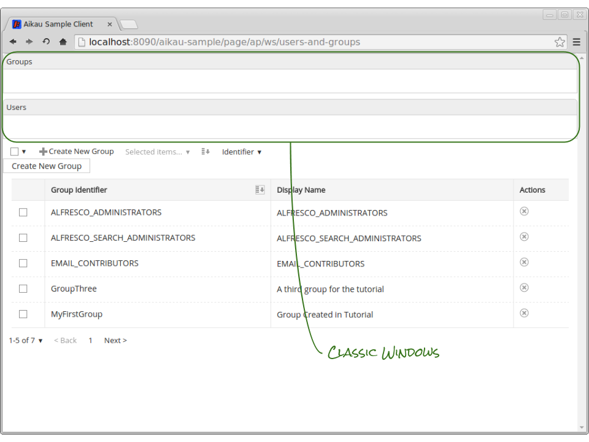
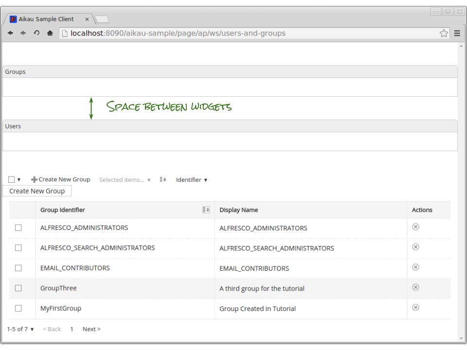
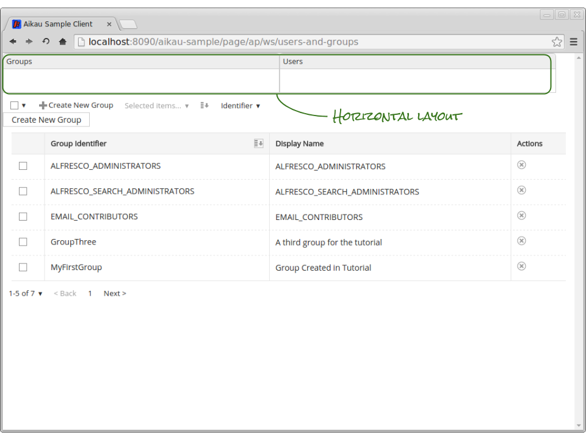
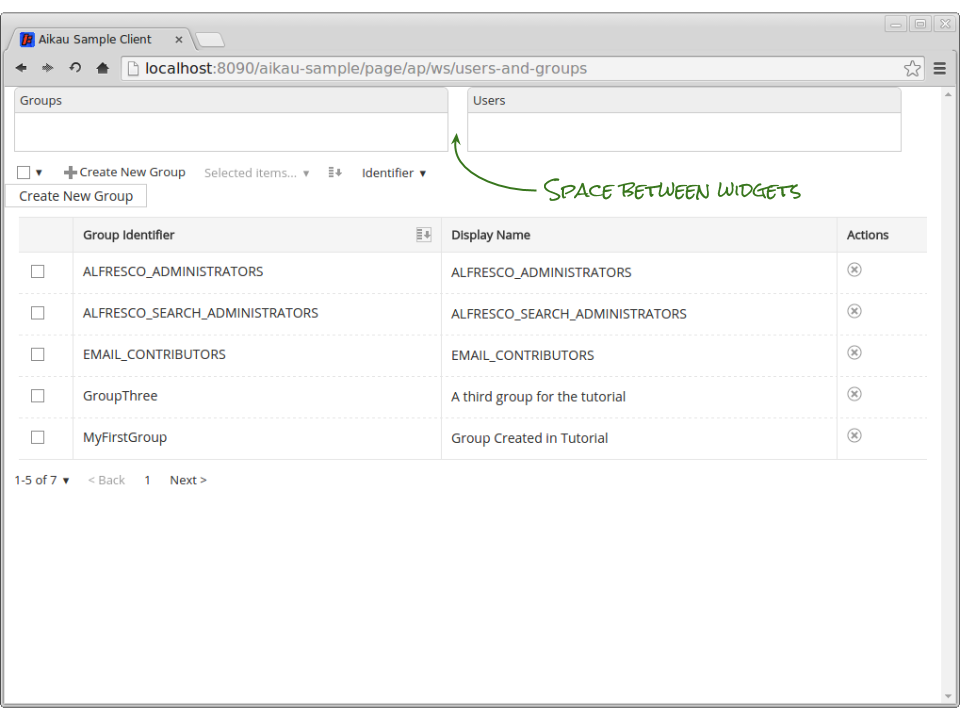
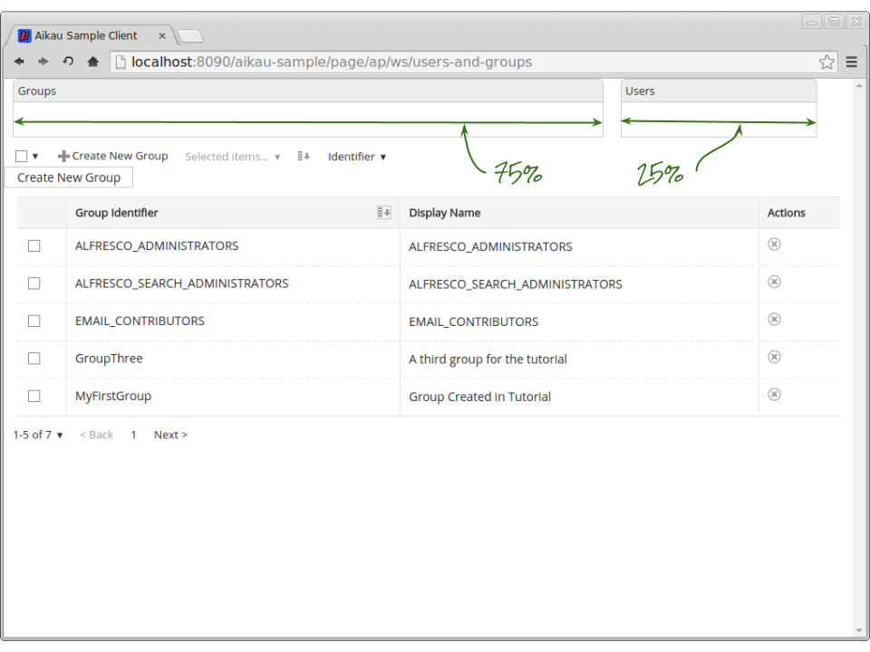
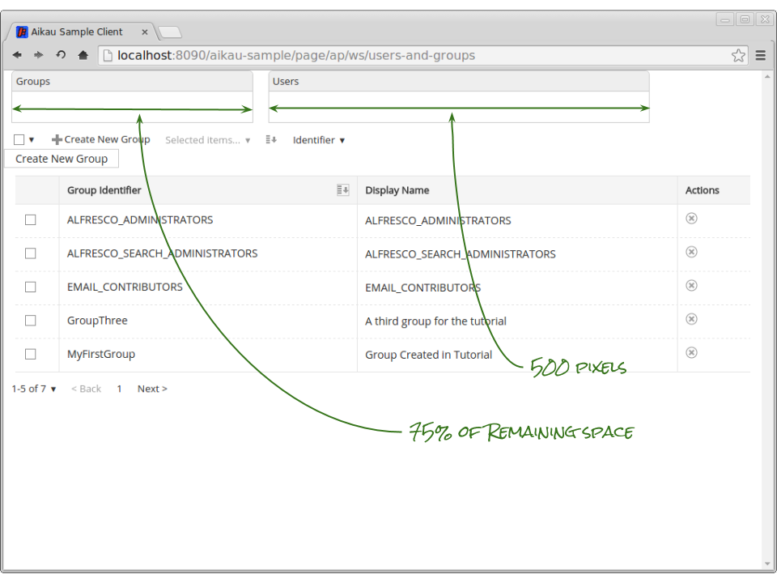
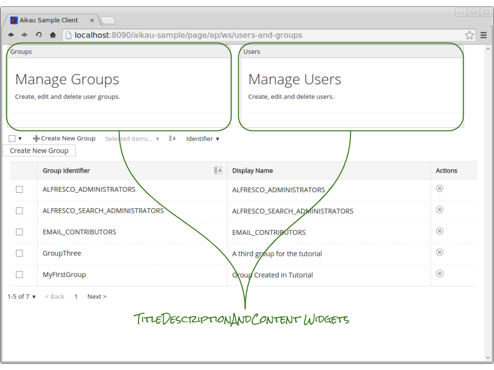
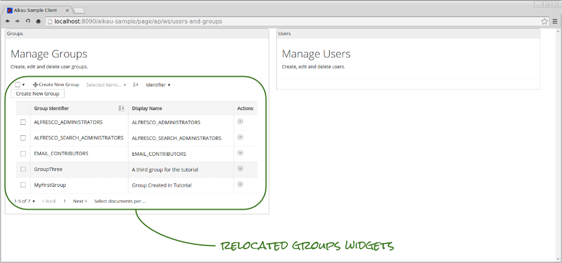
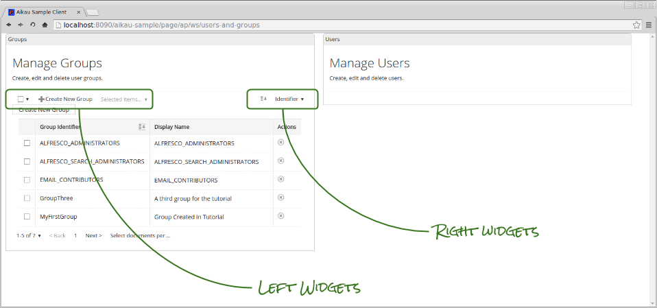

Previous: [Introducing Menus](./Tutorial12.md),
Next: [Recap for User Management](./Tutorial14.md)

## Tutorial 13 - Introducing Layout

Up until now we’ve focused solely on the groups part of our users and groups page. In this tutorial we’re going to introduce some layout widgets to make some space on the page for managing users.

Hopefully you’re getting familiar with the Aikau pattern of nesting widgets within other widgets. Layout is handled in exactly the same way. The most basic building blocks of layout are the `alfresco/layout/HorizontalWidgets` and `alfresco/layout/VerticalWidgets` modules. 

Although these two widgets only allow you to create rows and columns of other widgets, it is still possible to create quite complex layouts with them. To show them in action we’ll use them in conjunction with another module, `alfresco/layout/ClassicWindow`, that will help us to see how the space on the page is being laid out.

### Step 1 - Vertical Widgets
Add the following as the first entry in the “widgets” array attribute of your page model:

```JAVASCRIPT
{
  name: "alfresco/layout/VerticalWidgets",
  config: {
    widgets: [
      {
        name: "alfresco/layout/ClassicWindow",
        config: {
          title: "Groups",
          additionalCssClasses: "no-margin"
        }
      },
      {
        name: "alfresco/layout/ClassicWindow",
        config: {
          title: "Users",
          additionalCssClasses: "no-margin"
        }
      }
    ]
  }
},
```

When you refresh the page you’ll see two “windows” stacked on top of each other (and of course the groups list immediately below it).



You can space out the widgets by setting the `widgetMarginTop` and `widgetMarginBottom` attributes. Try updating the configuration to look like this:

```JAVASCRIPT
{
   name: "alfresco/layout/VerticalWidgets",
   config: {
      widgetMarginTop: "50",
      widgetMarginBottom: "50",
      widgets: [
```

When you refresh the page you’ll see that there now more space between the windows.



### Step 2 - Horizontal Widgets
Now change the `alfresco/layout/VerticalWidgets` widget to be a `alfresco/layout/HorizontalWidgets` widget (you can remove the `widgetMarginTop` and `widgetMarginBottom` attributes if you’d like, but it’s not essential - Aikau is quite forgiving of irrelevant configuration).

When you refresh the page you’ll see that the windows are now laid out side by side. 



Unlike the vertical layout there is no space automatically allocated between each child widget. This can be addressed with the `widgetMarginLeft` and `widgetMarginRight` attributes. Update the model so set these now:

```JAVASCRIPT
{
   name: "alfresco/layout/HorizontalWidgets",
   config: {
      widgetMarginLeft: "10",
      widgetMarginRight: "10",
      widgets: [
```

This should result in the following layout:



### Step 3 - Percentage Width
Each window is given an equal share of the available horizontal space by default. We can configure each widget to have a different share of the space. Update the model to set `widthPc` on the `ClassicWindow` widgets like this:

```JAVASCRIPT
{
   name: "alfresco/layout/HorizontalWidgets",
   config: {
      widgetMarginLeft: "10",
      widgetMarginRight: "10",
      widgets: [
         {
            name: "alfresco/layout/ClassicWindow",
            widthPc: "75",
            config: {
               title: "Groups",
               additionalCssClasses: "no-margin"
            }
         },
         {
            name: "alfresco/layout/ClassicWindow",
            widthPc: "25",
            config: {
               title: "Users",
               additionalCssClasses: "no-margin"
            }
         }
      ]
   }
},
```

Note that the `widthPc` attribute is outside the `config` object of the `ClassicWindow` widgets. This is because it is not an attribute of the `ClassicWindow` but is instead information for the `HorizontalWidgets` widget on how to instantiate each `ClassicWindow` widget.

The “widthPc” attribute indicates the percentage of remaining space that the widget should take up after all other deductions (such as the margins) have been consumed. 



### Step 4 - Fixed Width
It is also possible to set a fixed width in pixels. This is done using the `widthPx` attribute and it is possible to mix both width types. Update the configuration to set a fixed width on the “Users” window like this:

```JAVASCRIPT
widgets: [
   {
      name: "alfresco/layout/ClassicWindow",
      widthPc: "75",
      config: {
         title: "Groups",
         additionalCssClasses: "no-margin"
      }
   },
   {
      name: "alfresco/layout/ClassicWindow",
      widthPx: "500",
      config: {
         title: "Users",
         additionalCssClasses: "no-margin"
      }
   }
]
```

When you refresh the page you should see that the `ClassicWindow` widgets have different widths… but what is really cool is that when you resize your browser window that only the Groups `ClassicWindow` changes in size. The width automatically updates to be 75% of the available space after the fixed width consumed by the other window has been deducted.



Try adding in more `ClassicWindow` widgets - if they aren’t given either `widthPc` or `widthPx` attributes then they will just be given an equal share of whatever space is left.

### Step 5 - Title, Description and Content
Remove the `widthPc` and `widthPx` attributes so that both `ClassicWindow` widgets get an even share of the space.

We’re now going to use another widget that will help indicate the purpose of each window. Add the following to the `config` object of the Groups `ClassicWindow` widget:

```JAVASCRIPT
widgets: [
  {
    name: "alfresco/layout/TitleDescriptionAndContent",
    config: {
      title: "Manage Groups",
      description: "Create, edit and delete user groups. ",
      widgets:[
      ]
    }
  }
]
```

...and then add something similar (e.g. the same model structure but with different `title` and `description` attributes) to the User `ClassicWindow`.

When you refresh the page you should see the following layout.



Now move the widgets model that we’ve previously been working on (e.g. the `alfresco/menus/AlfMenuBar`, `alfresco/lists/AlfSortablePaginatedList` and `alfresco/documentlibrary/AlfDocumentListPaginator` widgets) into the empty `widgets` array.

Refreshing the page should result in the following:



We now have a nice space in which we can add our user management widgets (which we’ll do in the next tutorial).

### Step 6 - Aligning Widgets Left and Right
There are lots of interesting layout widgets in the `alfresco/layout` package but one that we can also make use of immediately on our page is the `alfresco/layout/LeftAndRight` module.

As the name suggests it allows you to align widgets either to the left or the right of the available space. Let’s use it now to tweak our menu.

Add the following at the beginning of the `widgets` array in the `alfresco/layout/TitleDescriptionAndContent` widget used to display groups:

```JAVASCRIPT
{
  name: "alfresco/layout/LeftAndRight",
  config: {
    widgets: [
      {
        name: "alfresco/menus/AlfMenuBar",
        align: "left",
        config: {
          widgets: []
        }
      },
      {
        name: "alfresco/menus/AlfMenuBar",
        align: "right",
        config: {
          widgets: []
        }
      }
    ]
  }
}
```
               
What we’re doing is splitting our menu bar into two separate menus… to complete the process move the `alfresco/documentlibrary/AlfSelectDocumentListItems`, `alfresco/menus/AlfMenuBarItem` and `alfresco/documentlibrary/AlfSelectedItemsMenuBarPopup` into the first `AlfMenuBar` that you’ve just added and the remainder of the widgets into the other.

Finally remove the now empty `AlfMenuBar` widget (from which you’ve just moved the widgets) and when you refresh the page you should see the change reflected as shown here:



Previous: [Introducing Menus](./Tutorial12.md),
Next: [Recap for User Management](./Tutorial14.md)
