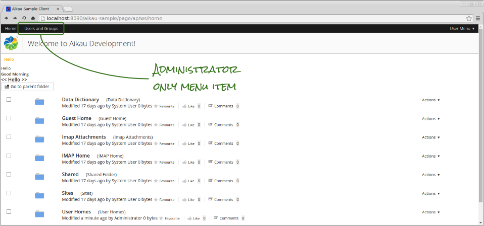
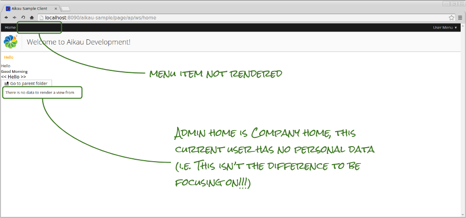
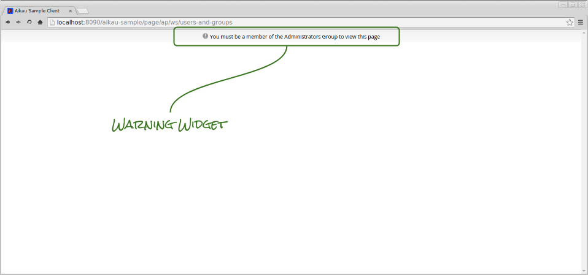
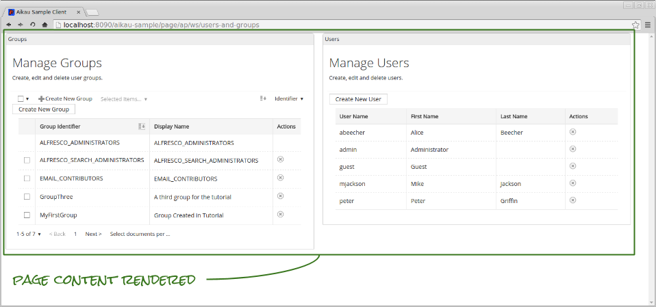

Previous: [Recap for User Management](./Tutorial14.md)
Next: [More Form Controls](./Tutorial16.md)

## Tutorial 15 - Introducing Rendering Filters

Now that we can create users and groups lets make some updates to our client so that it behaves differently for users in different roles.

Remember way back in [Tutorial 3](./Tutorial3.md "Link to tutorial 3") we created a composite widget for our header bar? It would be really neat to add a link to that header to allow a user to navigate to our new user and group management page.

However, only members of the “ALFRESCO_ADMINISTRATORS” group have the appropriate privileges to create and edit users and groups. So we really only want to display that link if they’re a member of that group. This can be achieved through the use of `renderFilter` configuration.

### Step 1. Making Group Membership Information Available
First of all we need to make sure that the group membership information for the currently logged in user will be available. Update all of your page JavaScript controllers (e.g. `<PROJECT>/src/main/webapp/WEB-INF/webscripts/pages/home.get.js`) to include the following line of code:

```JAVASCRIPT
model.jsonModel.groupMemberships = user.properties["alfUserGroups"];
```

This line of code ensures that the membership information for the user is included and available for evaluation.

### Step 2. RenderFilter Configuration
Edit the `tutorial/Header` widget and add the following widget after the first `alfresco/menus/AlfMenuBarItem`:

```JAVASCRIPT
{
   name: "alfresco/menus/AlfMenuBarItem",
   config: {
      label: "Users and Groups",
      targetUrl: "ap/ws/users-and-groups",
      renderFilterMethod: "ANY",
      renderFilter: [
         {
            target: "groupMemberships",
            property: "GROUP_ALFRESCO_ADMINISTRATORS",
            values: [true]
         }
      ]
   }
}
```

The `renderFilterMethod` and `renderFilter` attributes can be used to configure any widget and they control whether or not it will be rendered on the page (this doesn’t mean whether or not it will be visible, it means whether or not it will exist).

The `renderFilterMethod` can be set to either “ANY” or “ALL” and dictates whether a single successfully evaluated rule will be sufficient for the widget to be rendered or if all the rules must be true.

The `renderFilter` is an array of objects where each object defines a single rule to be evaluated. The `target` is the instance variable of the widget (it can be a dot-notation property) and if not provided will default to `currentItem`.

The `property` attribute identifies the property within that target object to test the value of and lastly the `values` attribute is an array of values that the property must match in order for the rule to be satisfied.

When you log into the client as a member of the “ALFRESCO_ADMINISTRATORS” group (e.g. “admin”) then you will see the menu item, but if you log in as a user that is not a member of that group then you will not see the menu item.




### Step 3. Message Banners
Let’s imagine a scenario where a user know the URL of the user and groups management page and can access it directly by entering it into the browser address bar. Although they won’t have permission to manage users and groups we still don’t want them to think that they should have that ability.

Therefore we can conditionally change the rendering of the page to address this. Add the following as the first entry in the root `widgets` array of the page model:

```JAVASCRIPT
{
   name: "alfresco/header/Warning",
   config: {
      renderFilterMethod: "ALL",
      renderFilter: [
         {
            target: "groupMemberships",
            property: "GROUP_ALFRESCO_ADMINISTRATORS",
            renderOnAbsentProperty: true,
            values: [false]
         }
      ],
      warnings: [
         {
            message: "You must be a member of the Administrators Group to view this page",
            level: 3
         }
      ]
   }
},
```

The `alfresco/header/Warning` widget just outputs a banner message with an icon indicating the severity of the problem (defined by the `level` attribute). It’s configured with a `renderFilter` so that it only appears when the current user is not a member of the “ALFRESCO_ADMINISTRATORS” group.

Not that we’re using the `renderOnAbsentProperty` attribute to ensure that this widget is rendered. Although we’ve the `values` array to contain the boolean value false, the reality is that if the user is not a member of the group the property won’t be found at all. 

Now add the following `renderFilter` configuration to the `config` object of the main `alfresco/layout/HorizontalWidgets`:

```JAVASCRIPT
renderFilterMethod: "ALL",
renderFilter: [
   {
      target: "groupMemberships",
      property: "GROUP_ALFRESCO_ADMINISTRATORS",
      renderOnAbsentProperty: false,
      values: [true]
   }
],
```

This is the inverse of the previous rule and stops the widget (and therefore all the widgets it contains) from being rendered if the user is not a member of the “ALFRESCO_ADMINISTRATORS” group.

Login with such a user and you’ll see the warning displayed and no group or user information.



### Step 4. CurrentItem Based Render Filters
We can also add some fine grained control into our groups list. Remember the warnings about not deleting the “ALFRESCO_ADMINISTRATORS” group? Well, let’s just remove the ability to delete those groups from the client.

Add the following render filter configuration to both the `alfresco/renderers/Selector` and `alfresco/renderers/PublishAction` widgets in the groups list:

```JAVASCRIPT
renderFilterMethod: "ALL",
renderFilter: [
   {
      property: "shortName",
      values: ["ALFRESCO_ADMINISTRATORS"],
      negate: true
   }
],
```

Note that we’ve omitted the `target` attribute so that the target defaults to the `currentItem` instance variable of the widget. We’ve also added a `negate` attribute that inverts the rule so that the widget will be rendered when the `shortName` property of the `currentItem` instance variable is not “ALFRESCO_ADMINISTRATORS”.

When you refresh the page you’ll see that the widgets are not present for the “ALFRESCO_ADMINISTRATORS” group so that the user cannot delete them (at least not from our client!).



Previous: [Recap for User Management](./Tutorial14.md)
Next: [More Form Controls](./Tutorial16.md)
