Previous: [Introducing Rendering Filters](./Tutorial15.md),
Next: [Document Previews](./Tutorial17.md)

## Tutorial 16 - More Form Controls

When you created your form for adding a new user you will probably have just used the `alfresco/forms/controls/TextBox` widget to capture the input data. In this tutorial we’re going to make some improvements to this form, introducing some new widgets and some form configuration concepts.

### Step 1. Password Field
When you log into your client you’ll hopefully have noticed that the password is “masked” so that people standing behind you can’t read your password as you type it in. This is done using the `alfresco/forms/controls/Password` module that is an extension of the `alfresco/forms/controls/TextBox` module.

When providing a form field for entering a password you should obviously use this module, but when creating a password you also want to provide a confirmation field to ensure that the user has actually provided the password they thought they had without typos.

We can provide this capability by adding a second `alfresco/forms/controls/Password` widget that uses the `validateMatch` validator.

Update your form configuration so that the password field is captured using the `alfresco/forms/controls/Password`  module and then add a second version to validate that both entries are the same:

```JAVASCRIPT
{
   name: "alfresco/forms/controls/Password",
   config: {
      fieldId: "PASSWORD",
      label: "Password",
      description: "Enter a password for the new user",
      name: "password",
      requirementConfig: {
         initialValue: true
      }
   }
},
{
   name: "alfresco/forms/controls/Password",
   config: {
      fieldId: "CONFIRM_PASSWORD",
      label: "Confirm Password",
      description: "Re-enter the password to ensure the correct value was provided",
      name: "confirmPassword",
      validationConfig: [
         {
            validation: "validateMatch",
            errorMessage: "The passwords do not match",
            targetId: "PASSWORD"
         }
      ]
   }
}
```

The confirmation password is setting validation configuration to use the `validateMatch` validator that targets another field in the form. In this case it is validating that the confirmation password field value must match the password field value in order for the form to be valid.

You can use this validator with any form widgets - it is not tied to the `alfresco/forms/controls/Password` module in any way.

When you refresh the page you should see that the password fields are masked and that it is not possible to create a user until a password has been provided and confirmed.

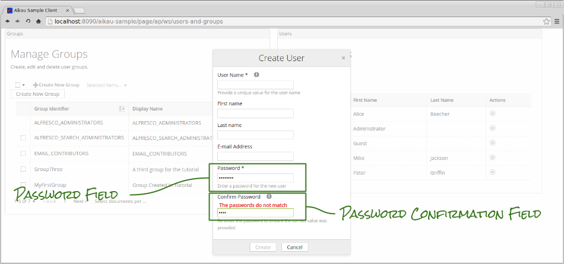

### Step 2. Minimum Character Length
When creating passwords we often want to make sure that a sensible number of characters have been provided. This can be achieved using the `minLength` validator. Update the password field to include this validation configuration:

```JAVASCRIPT
{
   name: "alfresco/forms/controls/Password",
   config: {
      fieldId: "PASSWORD",
      label: "Password",
      description: "Enter a password for the new user",
      name: "password",
      requirementConfig: {
         initialValue: true
      },
      validationConfig: [
         {
            validation: "minLength",
            errorMessage: "Passwords must be at least 8 characters long",
            length: 8
         }
      ]
   }
},
```

When you refresh the page you’ll find that you have to enter a password that is at least 8 characters long in order to create a user.

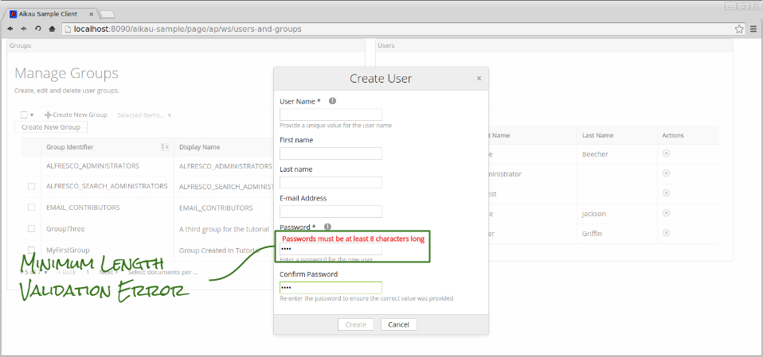

Maximum Character Length
Unsurprisingly there is also a `maxLength` validator that can be used in exactly the same way. It’s also possible to “chain” multiple validators together so that you can validate a single form field in multiple ways. Update the `validationConfig` attribute so that it becomes:

```JAVASCRIPT
validationConfig: [
   {
      validation: "minLength",
      errorMessage: "Passwords must be at least 8 characters long",
      length: 8
   },
   {
      validation: "maxLength",
      errorMessage: "Passwords can only be a maximum of 20 characters long",
      length: 20
   }
]
```

Now you have to enter a password that is between 8 and 20 characters long.

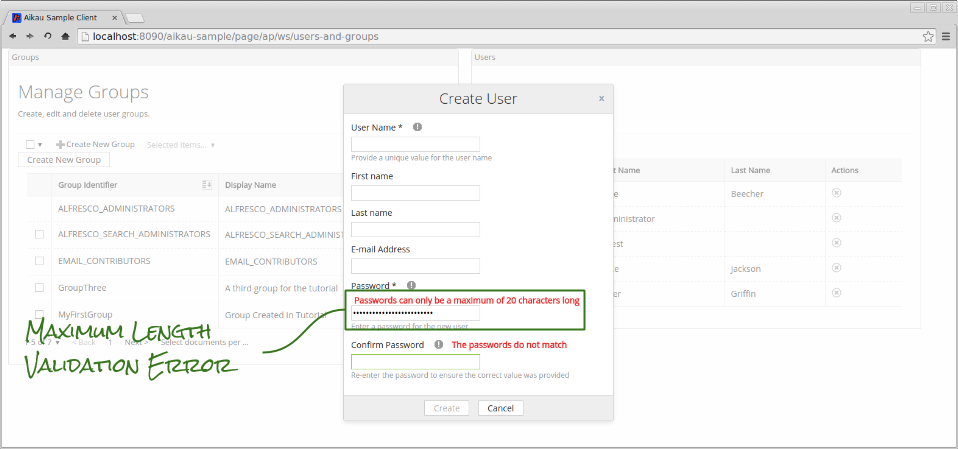

### Step 3. Regular Expression Validation
Although we briefly covered Regular Expression validation in an [earlier tutorial](./Tutorial7.md "Link to Form Dialogs tutorial") it is worth mentioning again, if only to demonstrate that multiple validation error messages can be displayed at the same time.

You often find that systems require passwords that cannot contain specific characters. We can enforce this using the `regex` validator combined with the `invertRule` attribute like this:

```JAVASCRIPT
validationConfig: [
   {
      validation: "minLength",
      errorMessage: "Passwords must be at least 8 characters long",
      length: 8
   },
   {
      validation: "maxLength",
      errorMessage: "Passwords can only be a maximum of 20 characters long",
      length: 20
   },
   {
      validation: "regex",
      regex: "([\"*\\><?/:|]+)|([.]?[.]+$)",
      errorMessage: "Passwords cannot contain any of the following characters: \" * \\ < > ? / : | %",
      invertRule: true
   }
]
```

When you refresh the page and try to provide a password containing an illegal character (such as “:”) then you’ll see the error message. If the password is less than 8 characters you’ll see both error messages displayed.

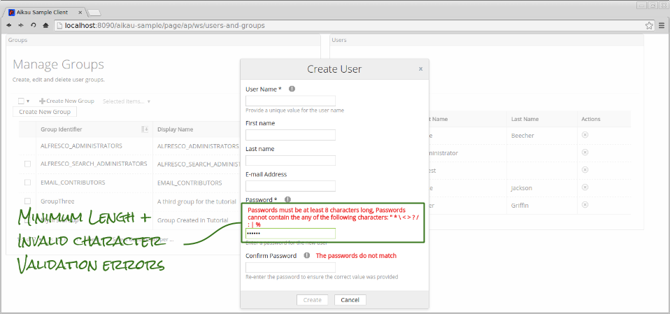

### Step 4. Asynchronous Validation
It’s also possible to perform asynchronous validation where an XHR request is required to retrieve the data needed to validate against. An example of this is to validate the uniqueness of a field value such as the username by checking the value provided against all the existing users.

We can use the `validateUnique` validator to implement this for the `username` field (as we know that the value provided must not duplicate any existing usernames). Update the model for the username widget to look like this:

```JAVASCRIPT
{
   name: "alfresco/forms/controls/TextBox",
   config: {
      fieldId: "USERNAME",
      label: "User Name",
      name: "userName",
      description: "Provide a unique value for the user name",
      requirementConfig: {
         initialValue: true
      },
      validationConfig: [
         {
            validation: "validateUnique",
            itemsProperty: "response.people",
            errorMessage: "This username is already in use",
            publishTopic: "ALF_CRUD_GET_ALL",
            publishPayload: {
               url: "api/people?filter="
            }
         }
      ]
   }
},
```

Once again we’re relying on the `alfresco/services/CrudService` to make the XHR request. This does mean that we need to carefully define the `itemsProperty` attribute so that the validator can find the array of users to search through for a duplicate entry.

Notice that we don’t need to identify the attribute within each existing user object to match against - the validator assumes that this will be the same as the `name` attribute in the form widget configuration.

When you refresh the page and start entering a value for the user name you should see a new icon appear indicating that validation is in progress. If you provide a value that matches an existing username then an error message will be displayed and you will not be able to submit the form.

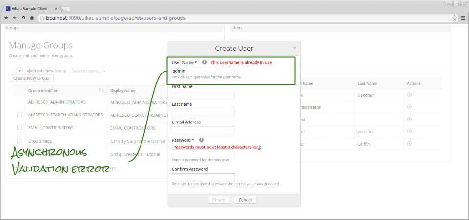

### Step 5. Progressive Disclosure
One pattern that you often see in forms is that of “progressive disclosure” to reduce clutter in the form and present only the minimum required information. 

When creating an Alfresco user it’s actually possible to provide a lot more information than we are currently collecting. However, in order to focus the user on the key fields we can easily hide the others unless they decide they want to add the extra information.

Let’s add a new checkbox to the form that will reveal some more fields when clicked. First add the following into the `widgets` array:

```JAVASCRIPT
{
   name: "alfresco/forms/controls/CheckBox",
   config: {
      fieldId: "SHOW_OTHER_FIELDS",
      label: "Add extra user information?",
      description: "Check this box to provide additional information about the user",
      name: "extra_info",
      value: false
   }
},
```

This will render a checkbox (initially unchecked as `value` is assigned false) that will reveal another field when clicked. Add the following after the checkbox:

```JAVASCRIPT
{
   name: "alfresco/forms/controls/TextBox",
   config: {
      fieldId: "JOBTITLE",
      label: "Job Title",
      description: "What does this user do?",
      name: "jobtitle",
      visibilityConfig: {
         initialValue: false,
         rules: [
            {
               targetId: "SHOW_OTHER_FIELDS",
               is: [true]
            }
         ]
      }
   }
}
```

The key part of the configuration here is the `visibilityConfig` section. This is where we are able to set an initial state and then define rules that will control whether or not the field is displayed.

We are setting a `targetId` attribute to match the `fieldId` attribute of the checkbox and then setting an array of values that the target field (the checkbox) must be in order for this field to be displayed.

It is also possible to use `isNot` rather than `is`, e.g. the rule could have been:

```JAVASCRIPT
isNot: [false]
```

...and it is also possible to have multiple values and multiple rules. 

When you refresh the page you’ll find that you are able to dynamically reveal and hide the new “jobtitle” field by checking and unchecking the box.

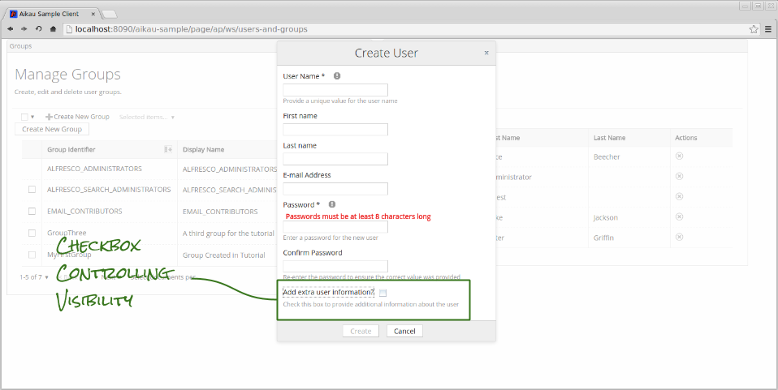
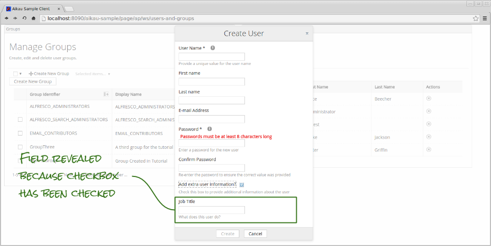

### Step 6. Dynamic Requirement and Disablement
It’s also possible to modify the rule construction to make rules change their requirement and disabled state through the use of the `requirementConfig` and `disablementConfig` attributes. 

We’ve already included plenty of examples of the `requirementConfig` attribute in order to set `initialValue`, but you should also be aware that you can dynamically control the state through rules as well.

### Step 7. Form Layout
Our dialog is starting to get quite long now. We can improve the layout through the use of the `alfresco/forms/ControlRow` module. This allows us to place multiple form controls on a single row as well as to provide a heading for a group of fields.

You can make a form a bit more organised by “wrapping” form control widgets in a model structure like this:

```JAVASCRIPT
{
   name: "alfresco/forms/ControlRow",
   config: {
      title: "User Details",
      description: "Essential user information.",
      widgets: [
      ]
   }
},
```

Try adding `alfresco/forms/ControlRow` widgets around the current widgets to organise the form so that it looks more like this:

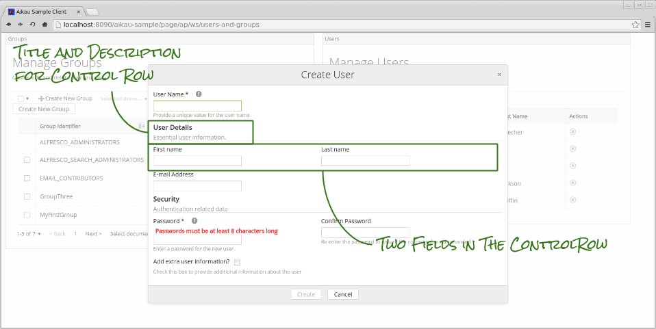

### Step 8. Multiple Entry Form Fields
One other useful Aikau module to be aware of (both in terms of use within page models and by extension for custom widgets) is the `alfresco/forms/controls/MultipleEntryFormControl`. This module (and its related modules) make it possible to create nested forms that allow the user to construct complex objects to submit.

In this example we’re going to construct a simple object (e.g. an array of string values) by using the `useSimpleValues` attribute, but if this is set to false then the value of a `alfresco/forms/controls/MultipleEntryFormControl` will always be an array of objects.

We’ll use this module to make it possible to assign a new user to one or more groups as they are created. Add the following to the new-user form `widgets` array:

```JAVASCRIPT
{
   name: "alfresco/forms/controls/MultipleEntryFormControl",
   config: {
      fieldId: "GROUPS",
      name: "groups",
      label: "Add to Groups",
      useSimpleValues: true,
      widgets: [
         {
            name: "alfresco/forms/controls/Select",
            config: {
               name: "value",
               label: "Select group",
               optionsConfig: {
                  publishTopic: "ALF_GET_FORM_CONTROL_OPTIONS",
                  publishPayload: {
                     url: url.context + "/proxy/alfresco/api/groups?zone=APP.DEFAULT",
                     itemsAttribute: "data",
                     labelAttribute: "displayName",
                     valueAttribute: "fullName"
                  }
               }
            }
         }
      ]
   }
}
```

This will render a form field containing a “plus” icon:

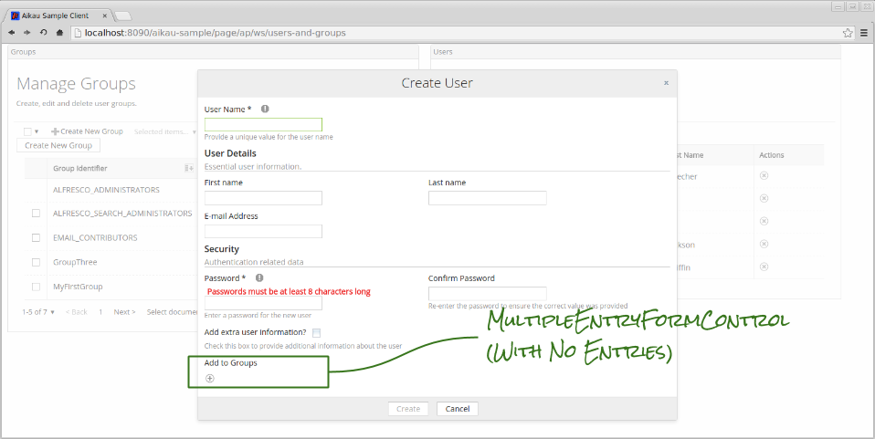

Click on the icon and you’ll be presented with a nested form (ours contains a single select field that allows us to pick a group).

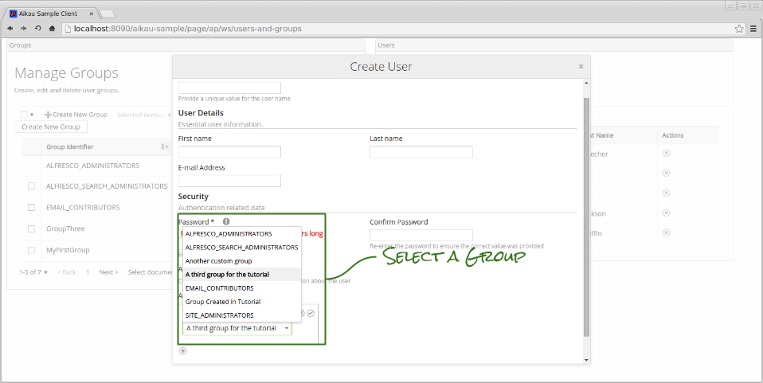

Once you’ve selected a group you can click the “tick” icon and the value of the nested form will be added as an element in the array that is the value of the field in the main form.

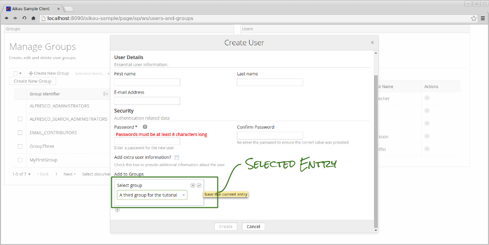

You can continue to add more groups and delete or edit previously created groups. Remember that this is a very simplistic example of using this form control and that you can add as many form controls into the `widgets` configuration array as you’d like. 

Previous: [Introducing Rendering Filters](./Tutorial15.md),
Next: [Document Previews](./Tutorial17.md)
