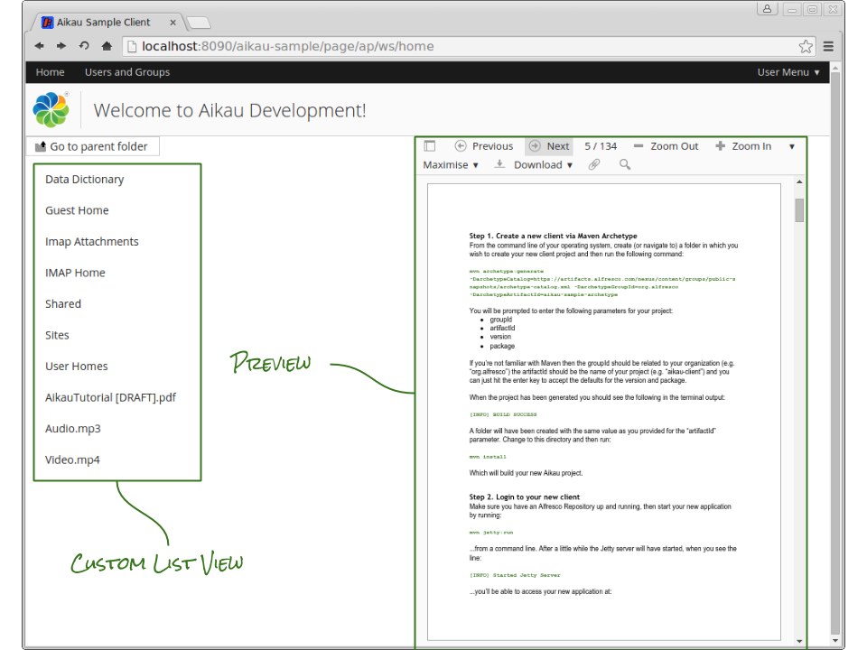

Previous: [More Form Controls](./Tutorial16.md),
Next: [Document Details Page](./Tutorial18.md)

## Tutorial 17 - Document Previews

In this tutorial we’re going to go right back to the first page that we worked on and start to develop it out so that it is a more rounded document management experience for the user.  Over the next few tutorials we’re going to strip back the list of documents to a basic rendering and then build it back up again and start to add in some additional features.

If you open up the home page JavaScript controller file (`<PROJECT>/src/main/webapp/WEB-INF/webscripts/pages/home.get.js`) the first thing we’ll want to do is clear out any of the custom widgets we were playing with and leave it as just the header, title (the `alfresco/layout/LeftAndRight` widget), the parent folder button, the document list and the upload widget.

### Step 1 - Clean Out the Original View
In the `alfresco/documentlibrary/AlfDocumentList` we were originally using an `alfresco/documentlibrary/views/AlfSimpleView` to render the view of documents. Hopefully you might recognize that this is an example of a “composite” widget as discussed in [Tutorial 3](./Tutorial3.md "Link to tutorial 3").

Replace the `alfresco/documentlibrary/views/AlfSimpleView` with a `alfresco/lists/views/AlfListView` widget and add a single `alfresco/lists/views/layouts/Row` containing a single `alfresco/lists/views/layouts/Cell` to it. 

It should look like this (you should be familiar with all these widgets from earlier tuorials):

```JAVASCRIPT
{
  name: "alfresco/documentlibrary/AlfDocumentList",
  config: {
    rootNode: "alfresco://user/home",
    rawData: true,
    widgets: [
      {
        name: "alfresco/lists/views/AlfListView",
        config: {
          widgets: [
            {
              name: "alfresco/lists/views/layouts/Row",
              config: {
                widgets: [
                  {
                    name: "alfresco/lists/views/layouts/Cell",
                    config: {
                    additionalCssClasses: "mediumpad",
                    widgets: []
                  }
                ]
              }
            }
          ]
        }
      }
    ]
  }
}
```

### Step 2 - Re-create Folder Links
Now we’re going to add in the ability to either drill down into folder or to preview of a specific document. We’re going to define two `alfresco/renderers/PropertyLink` widgets and configure each of them with a different `renderFilter` configuration based on whether or not the item is a container (a folder) or not.

The first widget definition will replicate exactly the same behaviour as before (e.g. allowing the user to drill down into a folder):

```JAVASCRIPT
{
   name: "alfresco/renderers/PropertyLink",
   config: {
      propertyToRender: "node.properties.cm:name",
      publishTopic: "ALF_DOCUMENTLIST_PATH_CHANGED",
      publishPayloadType: "PROCESS",
      useCurrentItemAsPayload: false,
      publishPayloadModifiers: ["processCurrentItemTokens"],
      publishPayload: {
         path: "{location.path}/{location.file}"
      },
      renderFilter: [
         {
            property: "node.isContainer",
            values: [true]
         }
      ]
   }
}
```

Again, the majority of this configuration should be familiar from earlier tutorials:

Attribute | Purpose
--- | ---
propertyToRender | The dot-notation address of a property in the object defining an item in the list (in this case we want to display the “cm:name” attribute of each item)
publishTopic| Defines the topic to publish when the link is clicked. This topic is subscribed to by the the `alfresco/documentlibrary/AlfDocumentList` and will be looking for a specific `path` attribute.
publishPayloadType | Set to “PROCESS” to allow us to construct the publication payload from attributes of the current item
useCurrentItemAsPayload | Overrides the default behaviour of a `alfresco/renderers/PropertyLink` widget which is to simply publish the current item object when clicked.
publishPayload | Allows us to construct our payload in order to build the path from information defined in the current item
renderFilter | Defines the behaviour in which to render the link - in this case when the item is the list is a container.

### Step 3 - Add Document Links
Now we want to add a link that previews a document. This will be `alfresco/renderers/PropertyLink`, but this time we can to publish on a topic subscribed to by the `alfresco/services/DocumentService` to handle requests to fetch individual document details from the Alfresco Repository.

The widget configuration looks like this:

```JAVASCRIPT
{
  name: "alfresco/renderers/PropertyLink",
  config: {
    propertyToRender: "node.properties.cm:name",
    publishTopic: "ALF_RETRIEVE_SINGLE_DOCUMENT_REQUEST",
    publishPayloadType: "PROCESS",
    useCurrentItemAsPayload: false,
    publishPayloadModifiers: ["processCurrentItemTokens"],
    publishPayload: {
       nodeRef: "{node.nodeRef}",
       rawData: true
    },
    renderFilter: [
      {
        property: "node.isContainer",
        values: [false]
      }
    ]
  }
}
```

The main difference between this `alfresco/renderers/PropertyLink` and the last is the `publishTopic` and `publishPayload` are different and that the `renderFilter` is passing when the item is not a container.

The “ALF_RETRIEVE_SINGLE_DOCUMENT_REQUEST” topic is subscribed to by the `alfresco/services/DocumentService` and when published will result in the service requesting the details of the document from the Alfresco Repository. Setting the `rawData` attribute in the `publishPayload` object ensures that the data is requested straight from the Repository as opposed to via the Alfresco Share client where additional data decoration will occur.

When the document details have been retrieved the `alfresco/services/DocumentService` will publish the data on the “ALF_RETRIEVE_SINGLE_DOCUMENT_REQUEST_SUCCESS” topic. We now need to add in some widgets that will be able to use that data to generate a preview.

### Step 4 - Create a side-by-side layout
We want to place our list of documents on the left of the page and our preview on the right. To do this we can use an `alfresco/layout/HorizontalWigets` widget (remember these from [Tutorial 13](./Tutorial13.md "Link to Tutorial 13")).

Add a new `alfresco/layout/HorizontalLayout` into the page and place the `alfresco/documentlibrary/AlfDocumentList` as the first widget into the `widgets` array of its configuration. Then add the following as the second widget in the array:

```JAVASCRIPT
{
  name: "alfresco/documentlibrary/AlfDocument",
  config: {
    nodeRef: null,
    rawData: true,
    widgets: [
      {
        name: "alfresco/preview/AlfDocumentPreview",
        config: {
          widgetsForPluginsOverrides: [
            {
              id: "PdfJs",
              replace: true,
              name: "alfresco/preview/PdfJs/PdfJs",
              config: {}
            }
          ]
        }
      }
    ]
  }
}
```

Here we’re adding an `alfresco/preview/AlfDocumentPreview` widget contained within an `alfresco/documentlibrary/AlfDocument` widget.

The purpose of the `alfresco/documentlibrary/AlfDocument` is to act as a container for single documents in exactly the same way that the `alfresco/documentlibrary/AlfDocumentList` acts as a container for lists of documents. If it is configured with a specific `nodeRef` attribute then it will publish on the “ALF_RETRIEVE_SINGLE_DOCUMENT_REQUEST” when created, but we want to allow the items in the list to drive requests.

The `alfresco/preview/AlfDocumentPreview` is a complex widget that allows documents to be previewed using a number of different “plugins” that are associated with specific document types. In this example we are overriding the default “PdfJs” plugin (that is Share specific) with an alternative version intended for standalone Aikau clients (like the one that we are building).

When we click on a document in the `alfresco/documentlibrary/AlfDocumentList` a topic will be published requesting the information for a single document. The `alfresco/services/DocumentService` will handle this request and retrieve the details of the selected document from the Alfresco Repository it will then publish them on a topic subscribed to by the `alfresco/documentlibrary/AlfDocument` which will then render the widgets that is has been configured with using the data provided. In this case the widget is an `alfresco/preview/AlfDocumentPreview` widget that will select an appropriate plugin for the document and render it in the browser.

Refresh the page, upload a variety of documents into a folder (e.g. a video file, an image, a PDF, a word documents, etc) and then select each item in the list to see a preview displayed.



### Step 5 - Taking a Shortcut
For this particular example we can actually shortcut the route via the `alfresco/services/DocumentService`. The data loaded for each item in the `alfresco/documentlibrary/AlfDocumentList` is actually sufficient for generating a preview. This means that instead of publishing on the “ALF_RETRIEVE_SINGLE_DOCUMENT_REQUEST” topic we publish on the “ALF_RETRIEVE_SINGLE_DOCUMENT_REQUEST_SUCCESS” document using the current item.

In order to make this work we have to configure the `alfresco/documentlibrary/AlfDocument` to expect the document data to be in a different location in the payload - in fact, we need to tell it that it is the payload. To do this add an additional `itemProperty` configuration attribute and assign it the empty string, like this:

```JAVASCRIPT
{
  name: "alfresco/documentlibrary/AlfDocument",
  config: {
    itemProperty: "",
    nodeRef: null,
    rawData: true,
    widgets: [
```

Then update the `alfresco/renderers/PropertyLink` so that it looks like this:

```JAVASCRIPT
{
  name: "alfresco/renderers/PropertyLink",
  config: {
    propertyToRender: "node.properties.cm:name",
    publishTopic: "ALF_RETRIEVE_SINGLE_DOCUMENT_REQUEST_SUCCESS",
    renderFilter: [
       {
          property: "node.isContainer",
          values: [false]
       }
    ]
  }
}
```

This will effectively save unnecessary XHR requests being made on the page. 


Previous: [More Form Controls](./Tutorial16.md),
Next: [Document Details Page](./Tutorial18.md)
