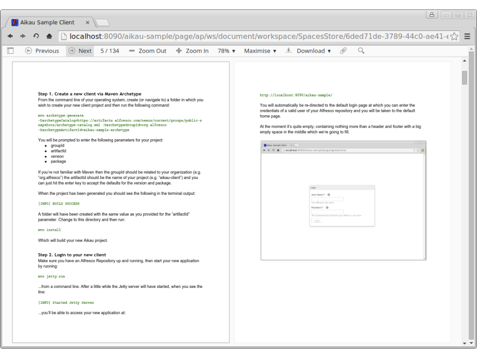

Previous: [Document Previews](./Tutorial17.md),
Next: [Accessibility](./Tutorial19.md)

## Tutorial 18 - Document Details Page

An alternative to the side-by-side layout approach would be to have an entirely separate page for rendering a document preview. To do this we’ll need a new WebScript for the page and will have to generate a link to that page.

### Step 1 - Create a new WebScript
Create 3 new WebScript files in the in the `<PROJECT>/src/main/webapp/WEB-INF/webscripts/pages` folder:

* document.get.desc.xml
* document.get.js
* document.get.html.ftl

...just as we did in [Tutorial 6](./Tutorial6.md "Link to Tutorial 6"). The `document.get.html.ftl` just needs the standard `<@processJsonModel/>` statement in it and the `document.get.desc.xml` needs to be configured to have the URL `/document` (if you don’t remember how to do this, then revisit Tutorial 6 where we followed the same steps to create our Users and Groups management page.

### Step 2  - Add a new URL template
Edit the `<PROJECT>/src/main/webapp/WEB-INF/surf.xml` file and find the following section:

```XML
<config evaluator="string-compare" condition="UriTemplate">
  <uri-templates>
    <uri-template id="share-page">/{pageid}/ws/{webscript}</uri-template>
  </uri-templates>
</config>
```

This section of configuration defines the “URI templates” that Surf uses to map URLs to specific WebScripts. If you have a deep understanding of Surf or prior experience with Alfresco Share then you may be familiar with using them. 

The main thing to understand is that when a URL is passed to Surf it will first inspect the list of URI templates to see if any are matched. If a match is found then the `pageid` token in that template will be used as the page to render.

If you examine the URLs that we have been using in our client (e.g. “http://localhost:8090/aikau-sample/page/ap/ws/home) you should see that they are all matching the single URI template in the configuration so that the actual page being rendered is “ap”.

This page then uses the `webscript` token included as part of the URI to render the WebScript that defines the contents of the page.

We want to include the NodeRef for the document in a URL so you should add the following template into the configuration. 

**NOTE: It must be the first URI template  in the list (e.g. before the existing URI template) because they are evaluated in order and the first matching template “wins”. This means that the more specific templates need to go before less specific templates.**

```XML
<uri-template id="nodeRefPage">/{pageid}/ws/{webscript}/{store_type}/{store_id}/{id}</uri-template>
```

This template starts the same but contains additional tokens for the `store_type`, `store_id` and `id` of the Node.

**NOTE: After you’ve added this template you’ll need to restart your Jetty server for the changes to take effect.**

### Step 3 - Accessing URI template tokens in a WebScript
In the JavaScript controller (`<PROJECT>/src/main/webapp/WEB-INF/webscripts/pages/document.get.js`) add the following `if` block:

```JAVASCRIPT
if (page.url.templateArgs.store_type != null && 
    page.url.templateArgs.store_id != null &&
    page.url.templateArgs.id != null)
{
 // Document widgets go here
}
else
{
  // Warning widget goes here
}
```

Here we are individually checking that all the expected tokens are available in the `page.url.templateArgs` object (which they should be in order for the URI template to have been matched!).

We can then use them to assemble a NodeRef with the following line of code:

```JAVASCRIPT
var nodeRef = page.url.templateArgs.store_type + "://" + page.url.templateArgs.store_id + "/" + page.url.templateArgs.id;
```
   
We can then use that attribute to configure an `alfresco/documentlibrary/AlfDocument` widget that we’ll use to retrieve the document to preview.

First let’s complete the `else` block so that we display a helpful message if a user arrives at the page with a badly formed URL. Add the following into the else block:

```JAVASCRIPT
model.jsonModel = {
  widgets:[
    {
      name: "alfresco/header/Warning",
      config: {
        warnings: [
          {
            message: "No document details provided",
            level: 3
          }
        ]
      }
    }
  ]
};
```

Once again we’re just re-using widgets that we’ve previously introduced in earlier tutorials. In this case its the `alfresco/header/Warning` widget that we’ve previously used to indicate when a user doesn’t have permission to view the users and groups page. Here we’re using it to let the user know that their URL is missing key information… try it using the URL: http://localhost:8090/aikau-sample/page/ap/ws/document and you should see the following:


### Step 4 - Add the Document and Preview Widgets
Now let’s add in the same document and preview widgets that we used for the side-by-side layout. Add the following into the `if` block:

```JAVASCRIPT
var nodeRef = page.url.templateArgs.store_type + "://" + page.url.templateArgs.store_id + "/" + page.url.templateArgs.id;
model.jsonModel = {
   services: [
      "alfresco/services/DocumentService"
   ],
   widgets:[
      {
         name: "alfresco/layout/FullScreenWidgets",
         config: {
            widgets: [
               {
                  name: "alfresco/documentlibrary/AlfDocument",
                  config: {
                     nodeRef: nodeRef,
                     rawData: true,
                     widgets: [
                        {
                           name: "alfresco/preview/AlfDocumentPreview",
                           config: {
                              widgetsForPluginsOverrides: [
                                 {
                                    id: "PdfJs",
                                    replace: true,
                                    name: "alfresco/preview/PdfJs/PdfJs",
                                    config: {}
                                 }
                              ]
                           }
                        }
                     ]
                  }
               }
            ]
         }
      }
   ]
};
```

The main things to notice are that we’re configuring the `nodeRef` attribute for the `alfresco/documentlibrary/AlfDocument` and are including the `alfresco/services/DocumentService` on the page to handle requests to retrieve document data from the Alfresco Repository.

### Step 5 - Update the link
We need to update our home page so that document `alfresco/renderers/PropertyLink` widgets make a navigation request to take the user to our new page.

Edit the JavaScript controller for the home page (`<PROJECT>/src/main/webapp/WEB-INF/webscripts/pages/home.get.js`) and change the `alfresco/renderers/PropertyLink` for documents (remember that we added two - one for folders and one for documents) to be the following:

```JAVASCRIPT
{
  name: "alfresco/renderers/PropertyLink",
  config: {
    propertyToRender: "node.properties.cm:name",
    publishTopic: "ALF_NAVIGATE_TO_PAGE",
    publishPayloadType: "PROCESS",
    useCurrentItemAsPayload: false,
    publishPayloadModifiers: ["processCurrentItemTokens","convertNodeRefToUrl"],
    publishPayload: {
       url: "ap/ws/document/{node.nodeRef}",
       type: "SHARE_PAGE_RELATIVE",
       target: "CURRENT"
    },
    renderFilter: [
      {
        property: "node.isContainer",
        values: [false]
      }
    ]
  }
}
```

We’re now publishing on the “ALF_NAVIGATE_TO_PAGE” topic (we’ll add in a service to handle this in a moment) and generating a “publishPayload” containing the information required to generate a link:

* `url` is a fragment of URL that we need
the “type” is set to “SHARE_PAGE_RELATIVE” which indicates that the URL fragment is relative to the “<application-context>/page” (in our case “aikau-sample/page”).
* `target` indicates whether or not the URL should be opened in the current browser tab or a new one.

The last minor but significant change is the inclusion of the additional `convertNodeRefToUrl` payload modifier. This modifier ensures that values contain URL friendly representations of NodeRefs.

Finally we need to update the list of services on the page to include the `alfresco/services/NavigationService` that will subscribe to the “ALF_NAVIGATE_TO_PAGE” topic and navigate the user to the appropriate page.

When you refresh the page you should be able to click on a document link and will be taken to the new page.



Previous: [Document Previews](./Tutorial17.md),
Next: [Accessibility](./Tutorial19.md)
