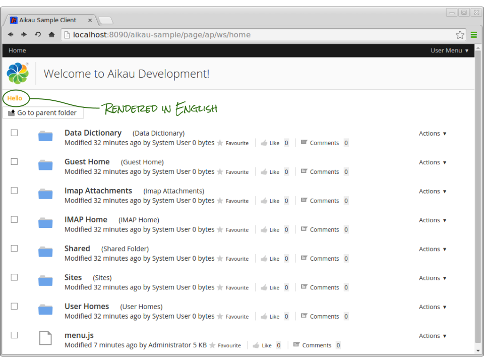
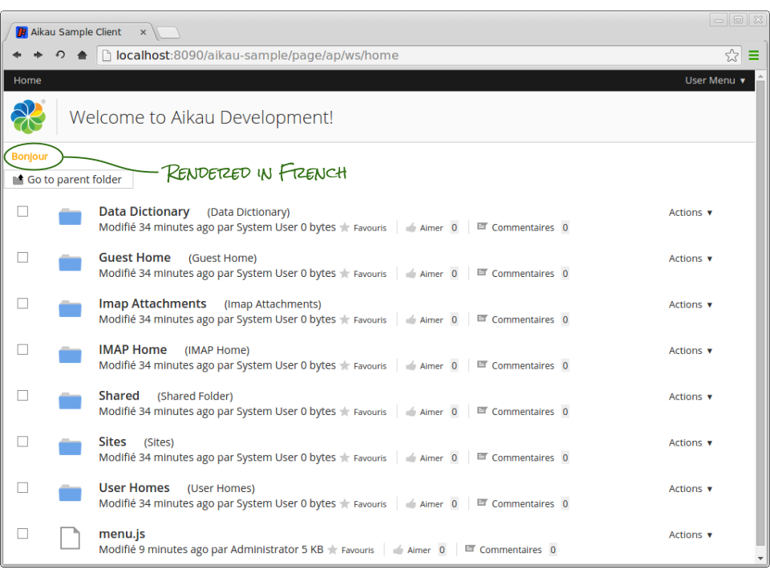

Previous: [Getting Started](./Tutorial1.md),
Next: [Create a Composite Widget](./Tutorial3.md)

## Tutorial 2 - How to Create a new Widget
A typical Aikau widget comprises the following base files:
* A JavaScript source file
* An HTML template file
* A CSS file
* An i18n properties file (as well as all any additional locale versions)

The most important file is the JavaScript source file as this is what is referenced in page models. It also declares all the other resources that are required in order for the widget to function correctly.

This tutorial will cover how to create a new widget that makes use of all the files. The widget we'll create is not truly representative of a typical widget but serves purely to provide a template for you to build on.

Each widget is considered a module and modules are referenced relative to the package in which they are created. The package is defined as the first element in the Module IDentifier (or MID) so for example, the `alfresco/logo/Logo` widget can be found in the `alfresco` package. 

### Step 1. Adding a New Package

Package locations are defined in the configuration used to bootstrap Dojo but Surf will take care of that for you. Look in the `<PROJECT>/src/main/webapp/WEB-INF/surf.xml` file and you’ll find the following section of configuration (it should be at line 96):

```XML
<dojo-pages>
  <!-- This indicates that Dojo page support is on - this means that the Dojo
       dependency handler bean will be checked by the ResourceController and that
       the relevant FreeMarker directives will be made available to WebScripts -->
   <enabled>true</enabled>
   <loader-trace-enabled>false</loader-trace-enabled>
   <messages-object>Alfresco</messages-object>
   <packages>
       <!-- Add custom packages here -->
   </packages>
</dojo-pages>
```

We're going to create a new package that will be used throughout the remainder of the tutorial when creating new widgets. This package will be called “tutorial” and the source files will be added to `<PROJECT>/src/main/webapp/js/tutorial` so we need to update the configuration to include this new package.

Add the following into the `<packages>` element.

```XML
<package name="tutorial" location="js/tutorial"/>
```

### Step 2. Creating Your First Widget

Create a new folder called `tutorial` in the `<PROJECT>/src/main/webapp/js` folder and then create the following files and folders in the newly created tutorial folder:

* `HelloWorld.js`
* `html/HelloWorld.html`
* `css/HelloWorld.css`
* `i18n/HelloWorld.properties`
* `i18n/HelloWorld_fr.properties`

**NOTE: Be careful to create BOTH folders and files and ensure that files are added to the correct folders to ensure that the rest of the tutorial instructions work. Placing the HTML files in a folder called “html” and CSS files in a folder called “css” is not essential. It's just a convention that we have adopted when writing our widgets and is a convenient way to organise widget source files.**

Add the following content to the `HelloWorld.js` file:

```JavaScript
define(["dojo/_base/declare",
        "dijit/_WidgetBase", 
        "dijit/_TemplatedMixin",
        "dojo/text!./html/HelloWorld.html",
        "alfresco/core/Core"], 
        function(declare, _WidgetBase, _TemplatedMixin, template, Core) {

   return declare([_WidgetBase, _TemplatedMixin, Core], {

      cssRequirements: [{cssFile:"./css/HelloWorld.css"}],

      i18nRequirements: [{i18nFile: "./i18n/HelloWorld.properties"}],

      templateString: template,

      postMixInProperties: function tutorial_HelloWorld__postMixInProperties()
      {
         this.greeting = this.message("greeting.label");
      }
   });
});
```

**NOTE: If you’re wondering why there is a reference to Dojo in the code it is because Aikau makes considerable use of the the Dojo AMD loader as well as the Dojo widget modules. For more information on writing AMD compliant widgets read [this page](http://dojotoolkit.org/reference-guide/1.10/quickstart/writingWidgets.html "Link to Dojo documentation") and it's linked pages.**

The most important thing to understand is the mapping between each declared dependency (the first argument passed to the `define` function) and the argument that it maps to in the callback function (the second argument passed to the `define` function). 

The purpose of the `define` function is to list other resources on which the widget depends. The `declare` function (returned by `define`) can be considered to be the widget instantiation function. The first argument is an array of other modules (which should all be included in the list of dependencies). The first module is the module that the widget extends (i.e. is an instance of – so in our example the `tutorial/HelloWorld` widget is an instance of `dijit/_WidgetBase`) and the other modules are “mixed in” to the instance (so that a mixed in module provide attributes and functions that the widget can call, extend or overwrite).

Add the following content to the `html/HelloWorld.html` file:

```HTML
<div class="tutorial-HelloWorld">${greeting}</div>
```

Note that this HTML file is referenced as a `dojo/text!` dependency in the JavaScript file. This HTML file is parsed into the widget source allowing various substitutions to be made, DOM elements mapped to widget instance variables and event handlers connected. For more information on writing templates see the [Dojo documentation](http://dojotoolkit.org/documentation/tutorials/1.10/templated/ "Link to Dojo documentation").

In this example we are simply substituting in the value of the `greeting` instance attribute. This is done using the `${ … }` syntax.

The `greeting` attribute is set in the `postMixInProperties` function and calls the `this.message( … )` function to get the locale specific value for the supplied message key. The `postMixInProperties` function is one of the extenion point functions provided by the `dijit/_WidgetBase` module and is called as part of the widget life-cycle, for more information on this extension point (and the other life-cycle extension points) see the [Dojo documentation](http://dojotoolkit.org/reference-guide/1.10/dijit/_WidgetBase.html ""Link to Dojo documentation").

We can add in some locale specific properties by updating `i18n/HelloWorld.properties` to contain:

```INI
greeting.label=Hello
```

...and “i18n/HelloWorld_fr.properties” to contain:

```INI
greeting.label=Bonjour
```

...and you can obviously add in support for as many other locales as you require by creating more`HelloWorld_{locale}.properties` files where {locale} is the locale (e.g. “de” for German, “es” for Spanish, etc).

Finally, in order to provide some specific widget styling we set the content of `css/HelloWorld.css` to be:

```CSS
.tutorial-HelloWorld {
   padding: 10px;
   color: orange;
   font-weight: bold;
}
```

Here we are again using an Aikau convention of making the root DOM element in the widget template, map to the complete widget path. This is done to ensure that the CSS selectors are scoped to a specific widget (although this obviously requires careful management of all your CSS selectors).

### Step 3. Include the Widget on a Page
We can easily include our new widget on the application home page by adding it to the model defined in the JavaScript controller `<PROJECT>/src/main/webapp/WEB-INF/webscripts/pages/home.get.js`

Add the following code into the model directly before the button that was added in the previous tutorial, e.g:

```JAVASCRIPT
{
  name: "tutorial/HelloWorld"
}, 
// Add more widgets here !!!
{
  name: "alfresco/buttons/AlfButton",
```

You will need to restart your Jetty server in order for the changes you made to the `surf.xml` file to take effect. Use the “CONTROL C” to stop the server and then restart again using the `mvn jetty:run` command as you did before.

When you reload the page you will see the greeting message displayed. If you switch your browser locale to be French then you will see the greeting change from “Hello” to “Bonjour”.




Previous: [Getting Started](./Tutorial1.md),
Next: [Create a Composite Widget](./Tutorial3.md)
