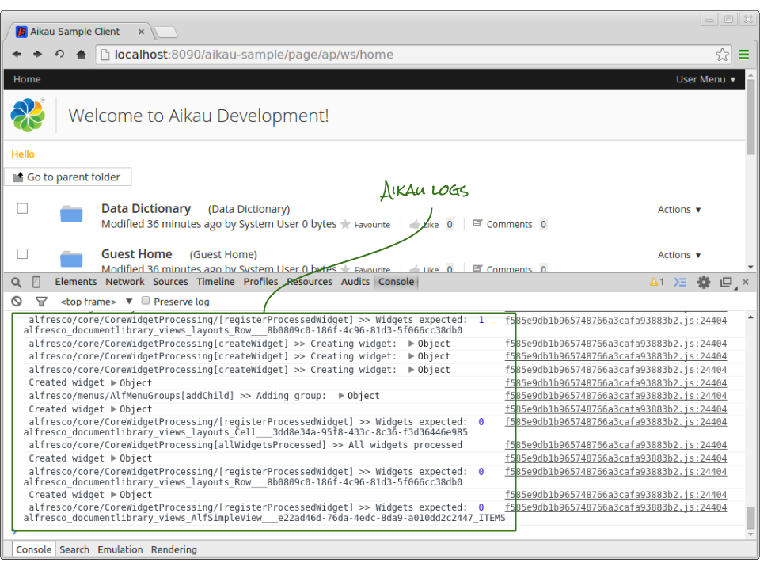
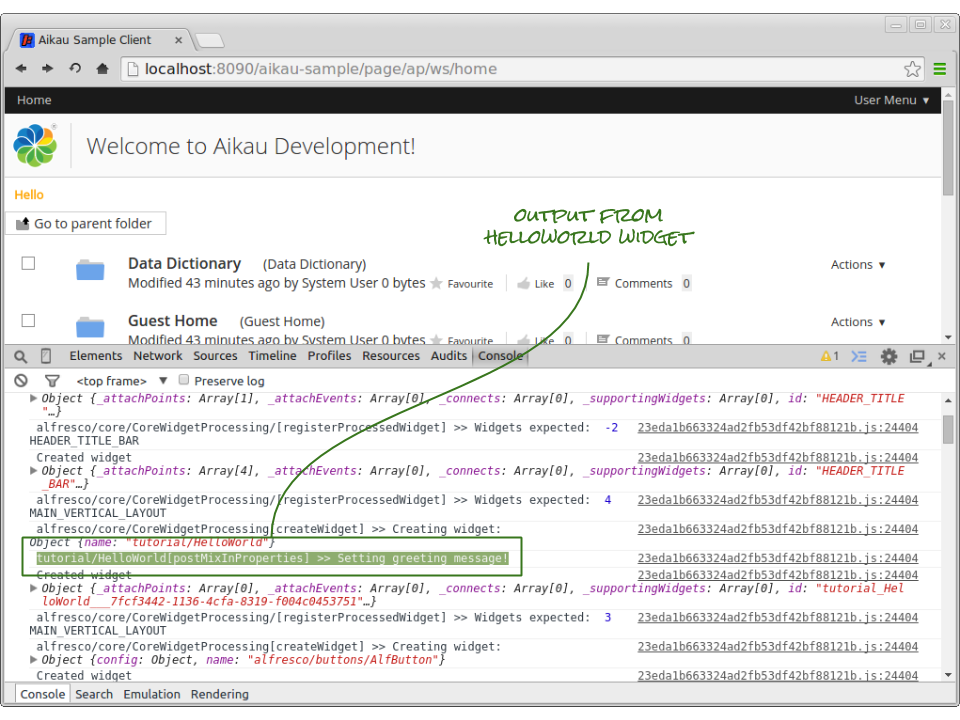
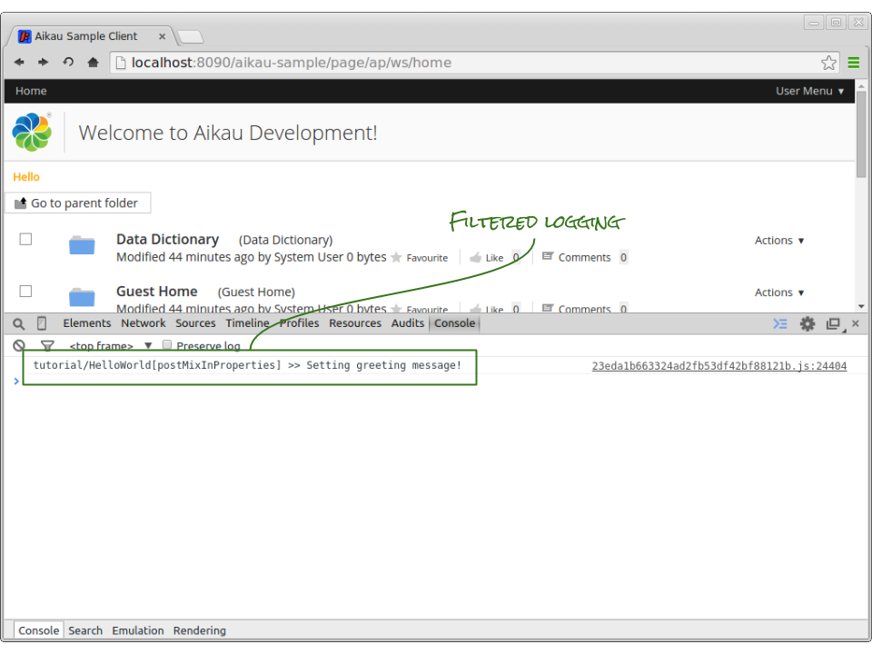
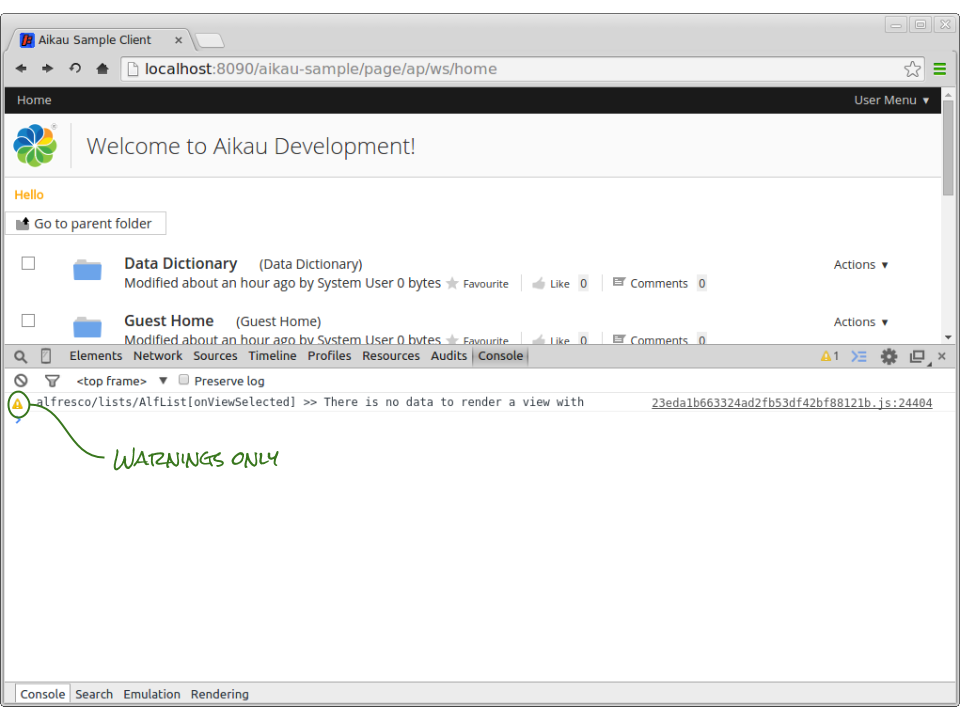
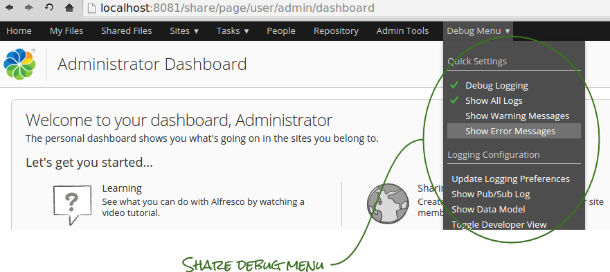
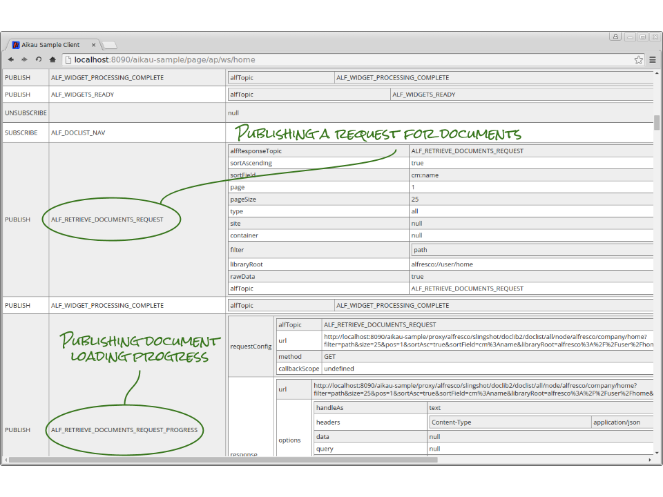

Previous: [Create a Composite Widget](./Tutorial3.md),
Next: [Variable Substitutions in Models](./Tutorial5.md)

## Tutorial 4 - Configuring Logging and Debug

Before we get too far into these tutorials it’s worth spending some time looking at what to do when things go wrong during development. There are already some great  tools in Aikau for debugging and we will continue to add more as the framework develops. In this tutorial we’re going to look at the `alfresco/services/LoggingService` and `alfresco/logging/SubscriptionLog` modules.

### Logging Service
The `alfresco/services/LoggingService` acts as a layer of abstraction between widgets and the browser console. The `alfresco/core/Core` module that is mixed into every Aikau widget and service provides an `alfLog` function which when called will publish logging information that the `alfresco/services/LoggingService` will handle.

If you’re wondering why widgets don’t call the `console` object of the browser directly it’s because this layer of abstraction allows us to filter logging (as we’ll see later) as well as provide other services to address logging. For example the Alfresco Share client can use the `alfresco/services/ErrorReporter` service to capture client side errors and POST them back to the web server. In this way administrators can track errors that users might report.

We can include the `alfresco/services/LoggingService` on our pages by adding it to the services array in the page model like this:

```JAVASCRIPT
model.jsonModel = {
  services: [
    {
      name: "alfresco/services/LoggingService",
      config: {
        loggingPreferences: {
          enabled: true,
          all: true
        }
      }
    },
```

In this particular example we are defining the level of logging required but it is also possible to configure the widget to access the current user’s logging preferences from the Alfresco Repository - you just need to remove the `config` section completely and include the `alfresco/services/PreferenceService` on the page as well.

When you load a page containing this configuration and inspect the browser console (usually done by pressing the F12 key) you’ll see logging appear. Try it with the home page to see:



### Adding Logging Code
Let’s add some logging code to the `tutorial/HelloWorld` widget, add the following into the `postMixInProperties` function. 

```JAVASCRIPT
this.alfLog("log", "Setting greeting message!");
```

Because you are making a change to a widget file you will need to clear the old version of the file that will have previously been cached. To do this go to the following URL: [http://localhost:8090/aikau-sample/service/index](http://localhost:8090/aikau-sample/service/index "Link to service index page").

...and click on the button marked “Clear Dependency Caches”. 

**IMPORTANT: Each time you make a change to a JavaScript, CSS, HTML or properties file related to a widget or service you will need to clear the caches in order to see the change without restarting the server.**

Now refresh the page and amongst all the logging will be the output from the HelloWorld widget….. hard to find wasn’t it?



Fortunately we can configure a filter on the LoggingService to only output messages from specific packages, modules or even functions. If you wondered why the HelloWorld widget was given a specific function name then this is why.

Update the `config` object of the LoggingService so that it looks like this:

```JAVASCRIPT
{
   name: "alfresco/services/LoggingService",
   config: {
      loggingPreferences: {
         enabled: true,
         all: true,
         filter: "tutorial/HelloWorld(.*)"
      }
   }
}
```

Refresh the page and look for the message in the browser console... bit easier to find this time wasn’t it?



The filter attribute allows us to set a Regular Expression to match the logged message. Hopefully you’ve noticed that the console very clearly indicates which module and function has issued the log request.

When you’re debugging a specific widget or function this facility can be particularly useful to filter out messages from widgets that you aren’t interested in.

### Log Levels
When using the “alfLog” function the first argument is the log level that you wish to use. This maps to the functions provided by most browser `console` objects. Typically you’ll want to use "log" ...but you might also want to use “info”, “warn” and “error” depending upon the severity of what your widget is reporting, e.g:

```JAVASCRIPT
this.alfLog("error", "Something has gone terribly wrong!");
```

The LoggingService can be quickly configured to only display warning and error messages by setting the “all” attribute to false and then setting boolean values for each specific log level, e.g. the configuration:

```JAVASCRIPT
{
   name: "alfresco/services/LoggingService",
   config: {
      loggingPreferences: {
         enabled: true,
         all: false,
         warn: true,
         error: true
      }
   }
}
```

...will only output warn and error messages.



### Dynamically Updating Logging Settings
The LoggingService subscribes to the `ALF_UPDATE_LOGGING_PREFERENCES` topic to allow you to add widgets that let the user dynamically control the log levels and filter that is currently in action. We’ll look into making use of the publication/subscription communication model in much more detail in later tutorials - but it’s worth remembering that this is possible. An example of this can be seen in the Alfresco Share client when running in debug mode.



### Publication/Subscription Logging
The primary purpose for the `alfresco/logging/SubscriptionLog` widget is for use in unit testing other widgets. When running in “client-debug” mode (as your client has been initially configured to do) it will log all publications and subscription that are performed using the `alfPublish` and `alfSubscribe` functions (provided by the `alfresco/core/Core` module).

However, the SubcriptionLog can also be used as debug and can be displayed in the Alfresco Share client by clicking on the the “Show Pub/Sub Log” menu item in the Debug Menu. When developing a page it can simply be added into the main `widgets` array of your WebScript controller.

Add the following as the last entry into root `widgets` attribute in the `<PROJECT>/src/main/webapp/WEB-INF/webscripts/pages/home.get.js` file:

```JAVASCRIPT
{
  name: "alfresco/logging/SubscriptionLog"
}
```

And you should see the following (when you scroll down to the bottom of the page)



Using this log is one of the best ways of seeing exactly how widgets are attempting to communicate with one another and is a useful tool to use when trying to get to resolve issues on your page.


Previous: [Create a Composite Widget](./Tutorial3.md),
Next: [Variable Substitutions in Models](./Tutorial5.md)
