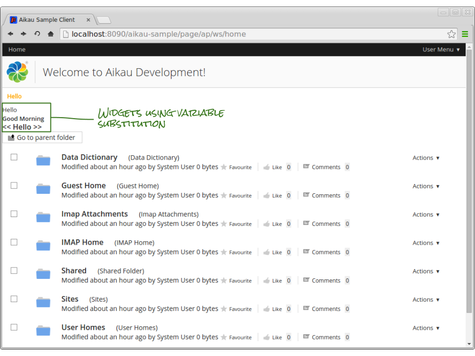
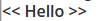

Previous: [Configuring Logging and Debug](./Tutorial4.md),
Next: [Creating a User and Group Management Page](./Tutorial6.md)

## Tutorial 5 - Variable Substitutions in Models
In the [composite widget tutorial](./Tutorial3.md) we created a widget that provided a convenient way to reference a model of widgets. The model was defined as an instance attribute of the widget and was not configurable. One common requirement is to be able to define a model in a widget that supports variable substitution.

There are two approaches to achieving this. The first is to set the `widgets` attribute in an instance function of the widget and the second is to use the `alfresco/core/ObjectProcessingMixin` module. In this tutorial we’ll explore both options and the reasons why you might pick one approach over the other.

When you define a JavaScript object prototype with a complex object attribute, the attribute is shared between all instances of that object. This means that if you change it in one instance then it will be applied to all instances. Our `widgets` attribute is an example of this particular problem so we need to be careful about how we manipulate it.

If we declare the `widgets` attribute to be null and then set its value in an instance function, we overcome the risk of the previous example. Imagine that we created a widget called `tutorial/Label` that extends `alfresco/core/ProcessWidgets` and contains the following code snippet:

```JAVASCRIPT
postCreate: function tutorial_Label__postCreate() {
  this.widgets = [
    {
      name: "alfresco/html/Label",
      config: {
        label: "Hello World!"
      }
    }
  ];
  this.processWidgets(this.widgets, this.containerNode);
},
```
 
This widget sets the `widgets` attribute of each specific instance such that other instances will not be affected. Another advantage is that it will have access to other instance variables that may have been provided as configuration attributes, e.g

```JAVASCRIPT
label: "Hello World!",

postCreate: function tutorial_Label__postCreate() {
  this.widgets = [
    {
      name: "alfresco/html/Label",
      config: {
        label: this.label
      }
    }
  ];
  this.processWidgets(this.widgets, this.containerNode);
},
```

Note that here we are able to safely use the “this” keyword to access other attributes and functions of the instance of the widget. This means that we could include this widget in a page model with configuration to override the default label, e.g:

```JAVASCRIPT
{
  name: "tutorial/Label",
  config: {
    label: "Different Greeting!"
  }
}
```

This would result in the `label` attribute being set to “Different Greeting” so that when the `widgets` attribute is set it will use the overridden label value.

The disadvantage of this approach is that it isn’t possible to completely override the `widgets` attribute through pure configuration in a page model. For example we might want to override the model like this:

```JAVASCRIPT
{
  name: "tutorial/Label",
  config: {
    widgets: [
      {
        name: "alfresco/html/label",
        config: {
          label: "Another Greeting",
          additionalCssClasses: "bold"
        }
      }
    ]
  }
}
```

This is only possible if we either check that `widgets` hasn’t been set, e.g:

```JAVASCRIPT
postCreate: function tutorial_Label__postCreate() {
  if (this.widgets == null)
  {
    this.widgets = [
      {
        name: "alfresco/html/Label",
        config: {
          label: this.label
        }
      }
    ];
  }
  this.processWidgets(this.widgets, this.containerNode);
},
```

Or we use a variable substitution approach. Let’s actually implement a widget that does just that.

### Creating a Model Substituting Widget
First create a file called `Label.js` in the `<PROJECT>/src/main/webapp/js/tutorial` folder and add the following contents:

```JAVASCRIPT
define(["dojo/_base/declare",
        "alfresco/core/ProcessWidgets",
        "alfresco/core/ObjectProcessingMixin",
        "dojo/_base/lang"], 
        function(declare, ProcessWidgets, ObjectProcessingMixin, lang) {
   
   return declare([ProcessWidgets, ObjectProcessingMixin], {

      label: "Hello",

      additionalCssClasses: "",

      widgets: [
         {
            name: "alfresco/html/Label",
            config: {
               label: "{label}",
               additionalCssClasses: "{additionalCssClasses}"
            }
         }
      ],

      postCreate: function tutorial_Label__postCreate() {
         if (this.widgets)
         {
            var clonedWidgets = lang.clone(this.widgets);
            this.processObject(["processInstanceTokens"], clonedWidgets);
            this.processWidgets(clonedWidgets, this.containerNode);
         }
      }
   });
});
```

Let’s step through some of the important lines and explain what they’re doing:

##### Dependencies
```JAVASCRIPT
"alfresco/core/ObjectProcessingMixin",
"dojo/_base/lang"],
```

Here we’re adding dependencies on two additional modules that we’ve not previously used. 
`alfresco/core/ObjectProcessingMixin` is going to be “mixed in” to our Label widget and will provide the variable substitution capabilities.

`dojo/_base/lang` is a utility library module that provides lots of useful capabilities that are documented [here](http://dojotoolkit.org/reference-guide/1.10/dojo/_base/lang.html "Link to Dojo documentation") and we’re going to use it to clone (make a copy of) our widgets instance attribute.

##### Extending and Mixing-In Modules
```JAVASCRIPT
return declare([ProcessWidgets, ObjectProcessingMixin], {
```

This line declares our Label widget and states that it extends ProcessWidgets and mixes in ObjectProcessingMixin. This means that the widget will inherit all of functions and attributes provided by both modules but that any extending module functions will override any functions of the same name that are provided by the mixed in modules.

##### Declaring Instance Variables
```JAVASCRIPT
label: "Hello",

additionalCssClasses: "",
```

Here we declare two attributes called `label` and `additionalCssClasses`. These are given default values but these can be overridden by attributes set in the “config” object when using the widget in a page.

##### Defining a Model With Substitution Variables
```JAVASCRIPT
widgets: [
  {
    name: "alfresco/html/Label",
    config: {
      label: "{label}",
      additionalCssClasses: "{additionalCssClasses}"
    }
  }
],
```

This is the widgets model that we want to create. The important thing to note here is the use of the curly brackets { } that identify the variables that we want to substitute. Note that they are for `label` and `additionalCssClasses` which must match the instance attributes that were defined earlier.

##### Processing the Model
```JAVASCRIPT
postCreate: function tutorial_Label__postCreate() {
  if (this.widgets)
  {
    var clonedWidgets = lang.clone(this.widgets);
    this.processObject(["processInstanceTokens"], clonedWidgets);
    this.processWidgets(clonedWidgets, this.containerNode);
  }
}
```

Finally this is the function that pulls everything together. Notice that we’ve defensively coded against the `widgets` instance attribute being configured to be `null` - even though it’s been set in the widget, the default value can still be overridden through configuration so it’s always a good idea to try to prevent the generation of errors that would otherwise cause the function to not complete.

Within the if block we first clone the widgets instance variable (remember that this is required to prevent the substitutions we’re about to make from being shared by all instances of this widget).

Then we call the `processObject` function to perform the variable substitution. This function is defined in the `alfresco/core/ObjectProcessingMixin` module and provides a number of processing functions. The functions you wish to use should be passed in an array as the first argument to the function. Here we’re requesting to use the `processInstanceTokens` function but there are several others available. It is also possible to define a custom function within our widget.

We pass our cloned widgets as the object to perform the processing on. The `processInstanceTokens` processing function will work through the object looking for variables marked with curly brackets and try to find a matching instance variable in the widget.

In this case it should match against the `label` and `additionalCssClasses` variable and substitute in their values.

Once processing is complete we call the `processWidgets` function that is provided by the `alfresco/core/ProcessWidgets` module that our widget extends. This function takes our cloned, processed widgets model and instantiates the widgets that it defines within the “containerNode” DOM element (which is again provided by the `alfresco/core/ProcessWidgets` module).

#### Configuring the Widget
Phew… that was a lot of explanation for what is actually quite a simple concept. Let’s now use our widget in our model and see it in action.

There are 3 ways in which we can now use our widget:
* With defaults variables
* Providing alternative variables
* With an alternative model

Update the home page JavaScript controller (`<PROJECT>/src/main/webapp/WEB-INF/webscripts/pages/home.get.js`) to include 3 instances of the Label widget as follows:

```JAVASCRIPT
{
  name: "tutorial/Label"
}, 
{
  name: "tutorial/Label",
  config: {
    label: "Good Morning",
    additionalCssClasses: "bold"
  }
}, 
{
  name: "tutorial/Label",
  config: {
    additionalCssClasses: "large",
    widgets: [
      {
        name: "alfresco/html/Label",
        config: {
          label: "<< {label} >>",
          additionalCssClasses: "bold {additionalCssClasses}"
        }
      }
    ]
  }
}, 
```

Refresh the page and you’ll see:



The first instance just uses the defaults and unsurprisingly renders:


The second instance configures the widget to change the label and to set an additional CSS class to make the label be rendered in a bold font: 


The third instance replaces the default widget model but still leverages the substitution capabilities that the widget provides to place the label within angled brackets and to ensure that the label is bold regardless of whatever other CSS classes might be applied: 




Previous: [Configuring Logging and Debug](./Tutorial4.md),
Next: [Creating a User and Group Management Page](./Tutorial6.md)
