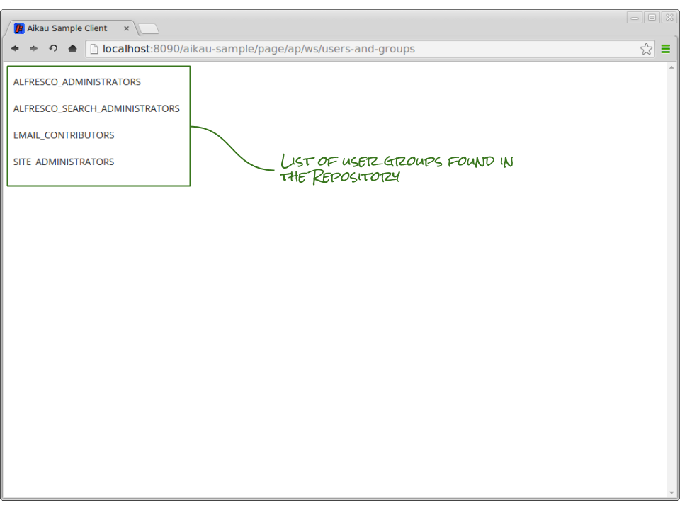

Previous: [Variable Substitutions in Models](./Tutorial5.md),
Next: [Form Dialogs](./Tutorial7.md)

## Tutorial 6 - Creating a User and Group Management Page

In the [first tutorial](./Tutorial1.md "Link to first tutorial") we added a widget to a page model that listed the contents of the user’s home folder. That example used a specialised form of the `alfresco/lists/AlfList` widget. In this tutorial we’re going to build a new page for managing the users and groups in the Alfresco Repository using this widget.

### Step 1. Create a new page
Up until now we’ve been working with the home page that was created by the Maven Archetype. Now we want to create a brand new page for managing users and groups. Each Aikau page is defined by a WebScript which consists of 4 file types:

* An XML descriptor that defines the URLs that can be used to call the WebScript
* A JavaScript controller file that builds a model to render a view
* A FreeMarker template to render the model
* i18n properties files for localised message strings

We’re going to look at localising page models in a later tutorial, so for now we just want to create the following 3 files in the `<PROJECT>/src/main/webapp/WEB-INF/webscripts/pages` folder:

* users-and-groups.get.desc.xml
* users-and-groups.get.js
* users-and-groups.get.html.ftl

If you’re not familiar with [WebScripts](http://docs.alfresco.com/4.2/concepts/ws-architecture.html "Link to Alfresco documentation") then it’s important to recognise that the names of these files must adhere to a specific pattern. 

Set the content of the files as follows:

#### WebScript Descriptor

The WebScriptor descriptor file should be found at `<PROJECT>/src/main/webapp/WEB-INF/webscripts/pages/users-and-groups.get.desc.xml`. Set it's contents to be:

```XML
<webscript>
  <shortname>Users and Groups</shortname>
  <family>Tutorial Pages</family>
  <url>/users-and-groups</url>
</webscript>
```

The only truly important line in this file (in the context of Aikau) is the `<url>` element. When you load your new page you will need to use the address: [http://localhost:8090/aikau-sample/page/ap/ws/users-and-groups](http://localhost:8090/aikau-sample/page/ap/ws/users-and-groups)

Note that the value of the `<url>` element is the last part of the URL - how the page URLs are mapped to WebScripts will be explained in a later tutorial.

#### WebScript Template

The WebScriptor template file should be found at `<PROJECT>/src/main/webapp/WEB-INF/webscripts/pages/users-and-groups.get.html.ftl`. Set it's contents to be:

```HTML
<@processJsonModel />
```

This single line is all you will ever need in your Aikau page WebScripts. It is a custom [FreeMarker directive](http://freemarker.org/docs/pgui_datamodel_directive.html "Link to FreeMarker documentation") that Surf provides to analyse the page model defined in the JavaScript controller. It ensures that all the required resource files are included on the page and creates the JavaScript to build the page from the model.

#### WebScript Controller

The WebScriptor controller file should be found at `<PROJECT>/src/main/webapp/WEB-INF/webscripts/pages/users-and-groups.get.js`. Set it's contents to be:

```JAVASCRIPT
model.jsonModel = {
   services: [
      "alfresco/services/CrudService"
   ],
   widgets:[
      {
         name: "alfresco/lists/AlfList",
         config: {
            loadDataPublishTopic: "ALF_CRUD_GET_ALL",
            loadDataPublishPayload: {
              url: "api/groups?sortBy=displayName&zone=APP.DEFAULT"
            },
            itemsProperty: "data",
            widgets: []
         }
      }
   ]
};
```

This is the initial model that we’ll iterate on to build our page. We’ll add widgets and services over several steps explaining what each of them does as we go.

#### Understanding the widgets

##### alfresco/services/CrudService

The CrudService is used to make [XHR requests](http://en.wikipedia.org/wiki/XMLHttpRequest "Link to Wikipedia page on XHR") to an Alfresco Repository using a URL fragment passed in published payload. It is a designed to aid prototyping when building new pages with the expectation that it's use in any given page will be replaced with a dedicated service at a later date. It is not intended to be used in a production page (and we’ll be removing it before the end of this tutorial) but is useful when you want to make rapid progress. The name refers to the fact that it supports the basic CRUD (Create, Read, Update and Delete) operations through subscriptions to the following topics:

* “ALF_CRUD_GET_ALL”
* “ALF_CRUD_GET_ONE”
* “ALF_CRUD_CREATE”
* “ALF_CRUD_UPDATE”
* “ALF_CRUD_DELETE”

Its benefit comes from the fact that you are able to specify the URL that you want to use in order to work with data - however, the disadvantage is that you are constrained to the URLs that you use. When you write a custom service to make XHR requests you have the opportunity to process both the request from the widget and the response back to it.

##### alfresco/lists/AlfList

The is the most basic list widget in Aikau (although as you’ll see it is still very feature rich) and should be considered as the widget that manages the state and views of data but it does not provide the actual rendering of that data.

We are configuring it to publish a topic to request data (with the `loadDataPublishTopic` attribute) via the CrudService (using the “ALF_CRUD_GET_ALL” topic) with a payload object containing a `url` attribute with an Alfresco Repository WebScript URL to retrieve all the user groups that have been configured.

It’s important to understand that the CrudService is designed to retrieve data from an Alfresco Repository so it cannot be passed full URL addresses. A list of the WebScript URLs that can be used can be browsed at this address: [http://localhost:8080/alfresco/service/index/uri/](http://localhost:8080/alfresco/service/index/uri/)

The AlfList widget is written to cope with all manner of data structures and by default it expects to receive a data payload with an array of items in the attribute `items`. However, if you enter the groups URL into a browser (e.g. [http://localhost:8080/alfresco/service/api/groups?sortBy=displayName&zone=APP.DEFAULT](http://localhost:8080/alfresco/service/api/groups?sortBy=displayName&zone=APP.DEFAULT)) then you’ll see that the JSON response actually has the list of groups in an array called `data`. 

As you work with the Alfresco Repository REST APIs you will find that there is some inconsistency between the response bodies of WebScripts that were implemented in early releases. This is a historical inconvenience and APIs added in more recent releases adhere to a consistent response schema.

In order for the AlfList to correctly identify the list of items to display we need to configure the `itemsProperty` attribute to match the response.

### Step 2. Create a List View
We now need to create a view to render the list that the AlfList will load. The AlfList can support multiple views and each view should be added as element in the `widgets` array that is currently empty.

In the first tutorial we added the widget `alfresco/documentlibrary/views/AlfSimpleView` which is an example of a [composite widget](./Tutorial3.md "Link to tutorial on creating composite widgets") which contains a view model. We’re now going to build a view model directly inside our AlfList configuration.

All views must be instances of `alfresco/lists/views/AlfListView`. This widget should also be configured with a `widgets` attribute which will be a model of the widgets for every item in the list.

Aikau provides a number of “building block” modules for constructing views, but for optimum performance you should consider writing your own view template to reduce client-side processing.

We’re going to construct a very basic view where each item is a row containing a single cell. Add the following into the empty `widgets` array (in the file `users-and-groups.get.js`):

```JAVASCRIPT
{
  name: "alfresco/lists/views/AlfListView",
  config: {
    widgets: [
      {
        name: "alfresco/lists/views/layouts/Row",
        config: {
          widgets: [
            {
              name: "alfresco/lists/views/layouts/Cell",
              config: {
                widgets: []
              }
            }
          ]
        }
      }
    ]
  }
}
```

This provides the basic structure of the view, but it still does not actually render any data from the list. This is where the widgets in the `alfresco/renderers` package come in.

### Step 3. Add Renderers
Aikau provides an entire package of widgets dedicated to rendering data. The most simple of these widgets is the `alfresco/renderers/Property` which can be used to render a single property from an element in a list. Let’s use this now to render the `displayName` of each group in the list. Add the following into the empty `widgets` array of the Cell widget you just added above:

```JAVASCRIPT
{
  name: "alfresco/renderers/Property",
  config: {
    propertyToRender: "displayName"
  }
}
```

You will need to [refresh WebScripts](./RefreshingWebScripts.md "Link to instructions for refreshing WebScripts") in order for your new WebScript files to be registered. You should then be able to view your at this address: [http://localhost:8090/aikau-sample/page/ap/ws/users-and-groups](http://localhost:8090/aikau-sample/page/ap/ws/users-and-groups). The page should look like this:



Previous: [Variable Substitutions in Models](./Tutorial5.md),
Next: [Form Dialogs](./Tutorial7.md)
