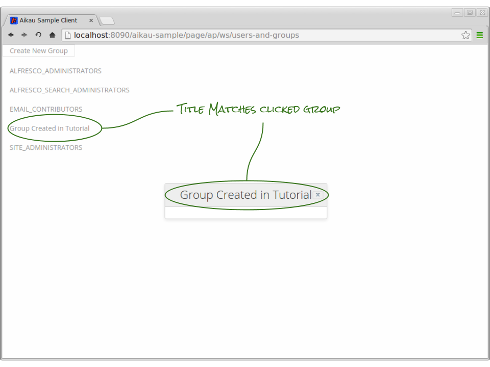
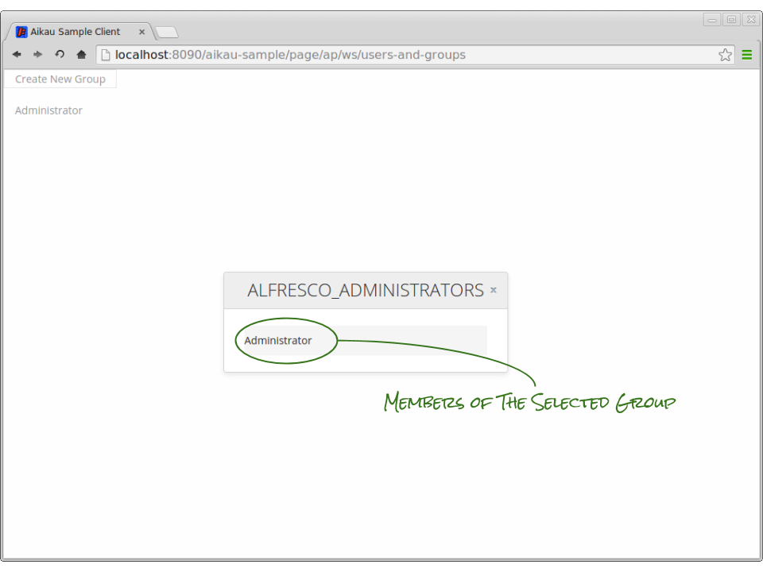
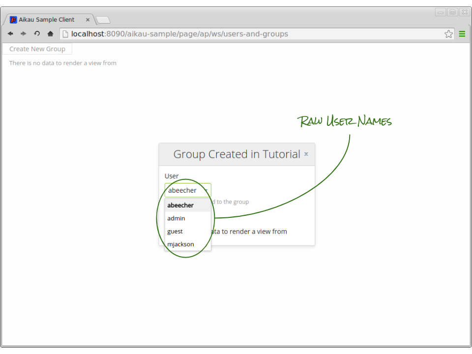
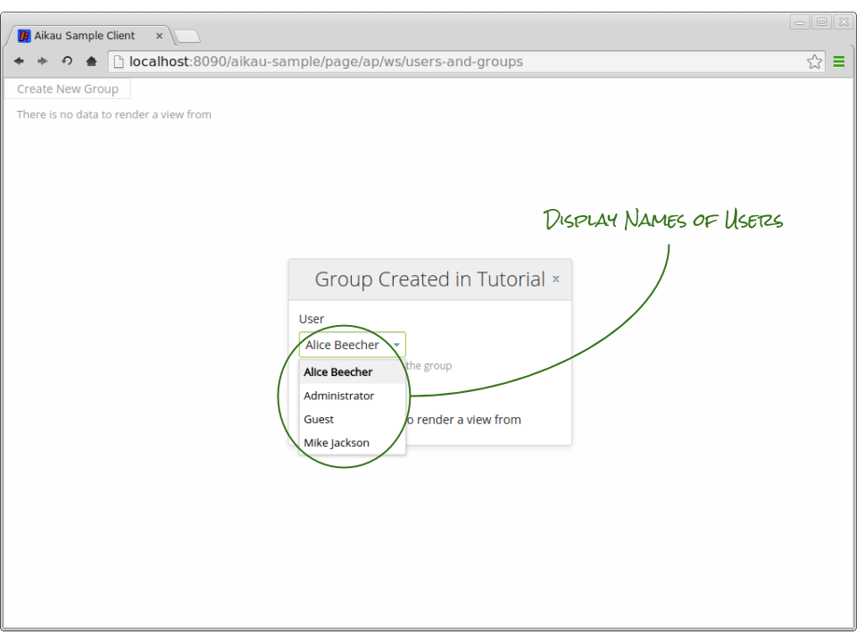
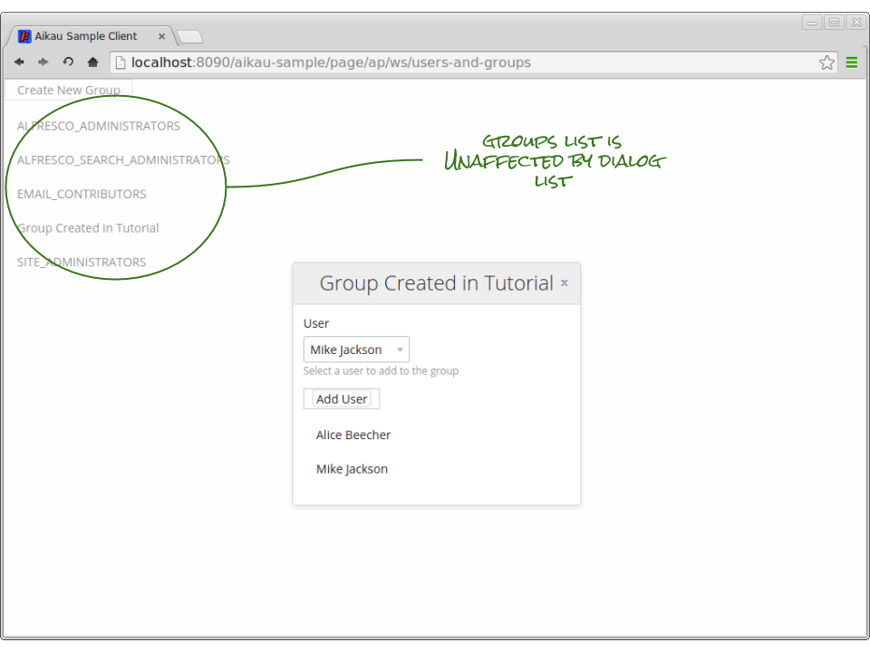

Previous: [Form Dialogs](./Tutorial7.md),
Next: [Actions in Lists](./Tutorial9.md)

## Tutorial 8 - Widget Dialogs

The `alfresco/services/DialogService` doesn’t just provide the ability to create form based dialogs. It also provides the capability to generate any widget model within a dialog. In this tutorial we’re going to utilize this capability to create a dialog that displays a list of all the users in each group. Along the way we’ll use a new view renderer widget, explore how to scope widget publications and see a further use of the `alfresco/core/ObjectProcessingMixin`.

We want to be able to view the list of users that belong to each group and we want to be able to edit that list. To do this we’re going to update our Group view so that when you click on the group identifier a dialog will be displayed listing all the members of that group.

### Step 1. Add a PropertyLink to Display a Dialog
Let’s start by converting the `alfresco/renderers/Property` into an `alfresco/renderers/PropertyLink` that will request a new dialog. Update the `<PROJECT>/src/main/webapp/WEB-INF/webscripts/pages/users-and-groups.get.js` JavaScript controller so that the PropertyLink configuration is created as follows:

```JAVASCRIPT
{
  name: "alfresco/renderers/PropertyLink",
  config: {
    propertyToRender: "displayName",
    useCurrentItemAsPayload: false,
    publishTopic: "ALF_CREATE_DIALOG_REQUEST",
    publishPayloadType: "PROCESS",
    publishPayloadModifiers: ["processCurrentItemTokens"],
    publishPayload: {
      dialogTitle: "{displayName}",
      fixedWidth: true,
      widgetsContent: []
    }
  }
}
```
 
A PropertyLink is very similar to a Property except that it supports the additional capability to publish a payload when it is clicked. The payload is generated by the `alfresco/renderers/_PublishPayloadMixin` that makes use of the `alfresco/core/ObjectProcessingMixin` module that was introduced in a previous tutorial.

The `_PublishPayloadMixin` is mixed into lots of Aikau widgets and provides a consistent way in which published payloads can be generated. In our example we’re setting the `publishPayloadType` attribute to be “PROCESS” and this will cause the `ObjectProcessingMixin` module processing functions to be made available.

We’re setting the `publishPayloadModifiers` attribute to be an array of the processing functions that we want to apply to our `payload` configuration object. In this case we’re using the `processCurrentItemTokens` processor (whereas in the earlier tutorial we were using the `processInstanceTokens` processor).

The object associated with each entry in a list is set as the `currentItem` instance variable on every widget in the view model. This means that each instance of `PropertyLink` widget will automatically be assigned a `currentItem` object for the group that it renders and the `processCurrentItemTokens` processor allows us to access that data.

This means that we can now use the curly bracket notation to reference some data for each group and in this example we’re going to use the group `displayName` property as the title for our new dialog.

Refresh the page and try clicking on a group - you should see that the dialog title reflects the display name of the group you clicked.



### Step 2. Add the Users List
Our dialog is still completely empty so we need to populate it with another `alfresco/lists/AlfList` widget. Add the following model to the empty `widgetsContent` array:

```JAVASCRIPT
{
  name: "alfresco/lists/AlfList",
  config: {
    waitForPageWidgets: false,
    loadDataPublishTopic: "ALF_CRUD_GET_ALL",
    loadDataPublishPayload: {
      url: "api/groups/{shortName}/children?sortBy=displayName&maxItems=50&skipCount=0"
    },
    itemsProperty: "data",
    widgets: [
      {
        name: "alfresco/documentlibrary/views/AlfDocumentListView",
        config: {
          widgets: [
            {
              name: "alfresco/lists/views/layouts/Row",
              config: {
                widgets: [
                  {
                    name: "alfresco/lists/views/layouts/Cell",
                    config: {
                      widgets: [
                        {
                          name: "alfresco/renderers/Property",
                          config: {
                            propertyToRender: "displayName"
                          }
                        }
                      ]
                    }
                  }
                ]
              }
            }
          ]
        }
      }
    ]
  }
}
```



The majority of this model should be relatively familiar to you as it is broadly similar to the model used to create the list of groups. However, there are a few key configuration attributes that should be called out:

Attribute | Purpose
--- | ---
waitForPageWidgets | The normal behaviour for any widget is to wait until all the widgets on a page have been rendered before starting to publishing topics. This is in order to ensure that services and widgets that might be subscribing to those topics are available.<br><br>The root widget on each page publishes the topic “ALF_WIDGETS_READY” once all widgets have been generated. The default behavior of the AlfList is to subscribe to that topic and only request data when it has been published on.<br><br>However, when we create a new AlfList in our dialog the “ALF_WIDGETS_READY” topic will already have been published so the list will be waiting forever. When we use an AlfList in this way we need to override the default `waitForPageWidgets` attribute to be `false` to indicate that the widget can request data as soon as it is created.
loadDataPublishPayload | Notice that we are again making use of the `processCurrentItemTokens` processor to ensure that we request the users for the group that has been selected. Here we are using “{shortName}” to configure each URL. It’s important to recognize that processing will walk an entire object looking for substitution variables.
itemsProperty | We’ve again had to override the default `itemsProperty` attribute - although we’ve needed to set a different value from last time. It’s important to check the response body or service payload that is providing the data for your lists. This is another good reason to use services to access data as you can return a payload using the default “items” value.

### Step 3. Add a Form to Add Users
We now want to add a form from which we can select users to add to the groups. We need to include an `alfresco/forms/Form` widget into our dialog model (unlike in the Add Group dialog where we explicitly requested a form dialog and the DialogService created one automatically for us).

Add the following into the `widgetsContent` array before the `AlfList` entry:

```JAVASCRIPT
{
   name: "alfresco/forms/Form",
   config: {
      okButtonLabel: "Add User",
      okButtonPublishTopic: "TUTORIAL_ADD_USER_TO_GROUP",
      okButtonPublishPayload: {
         groupId: "{shortName}"
      },
	okButtonPublishGlobal: true,
      showCancelButton: false,
      widgets: [
      ]
   }
},
```

This is a fairly simple form configuration where we’re setting a label, topic and payload for our ok (or confirmation) button and hiding the cancellation button. Notice again how we’re leveraging the `processCurrentItemTokens` processor again to include the identifier of the group that we’ve selected.

Also, notice the attribute `okButtonPublishGlobal`... this sets publication scope of the topic. We’re going to be discussing this shortly, but for now - just remember that it’s been set!

### Step 4. Update the Service
We’re setting a topic that is not handled yet, so let’s update our `tutorial/UserAndGroupsService` module to subscribe to it now. Add the following function:

```JAVASCRIPT
addUserToGroup: function tutorial_UserAndGroupService__addUserToGroup(payload) {
  this.serviceXhr({
    url: AlfConstants.PROXY_URI + "api/groups/" + payload.groupId + "/children/" + payload.userName,
    method: "POST",
    successCallback: this.onSuccess,
    callbackScope: this
  });
},
```

This function is incredibly similar to the function that we created to add new groups - the main difference being that the URL contains all the data required and we’re not including a data object in the POST request.

Now update the constructor to create a subscription bound to the function with the following line:

```JAVASCRIPT
this.alfSubscribe("TUTORIAL_ADD_USER_TO_GROUP", lang.hitch(this, this.addUserToGroup));
```

### Step 5. Add a User Select Control
We now need to add a form control to capture the “userName” value to be included in the payload published to this service.

We’re going to use a select form control this time and we’re going to need to retrieve a list of users from the Alfresco Repository to populate it with. There are 3 different ways in which we can do this, each with their own merits and we’ll go through them one by one. Let’s start though by actually declaring the form control. Add this into the empty `widgets` array of the `alfresco/forms/Form` widget:

```JAVASCRIPT
{
   name: "alfresco/forms/controls/Select",
   config: {
      label: "User",
      description: "Select a user to add to the group",
      name: "userName",
      optionsConfig: {
      }
   }
}
```

This is the basic configuration that we’re going to be working with. It’s very similar to the `alfresco/forms/controls/TextBox` configuration that we used when collecting the identifier and display name for creating groups. This is because all form controls extend the `alfresco/forms/controls/BaseFormControl` module that provides all the common form control behaviour. We’ll dive into this module in a later tutorial where we’ll describe how to create your own custom form controls.

This basic configuration is going to remain the same but we will be making changes to the `optionsConfig` attribute to control how we retrieve the user information. Let’s start with the simplest approach.

##### alfresco/services/OptionsService
The `alfresco/services/OptionsService` module is a service that Aikau provides to enable you to access data quickly and easily. Include it in the list of services on the page:

```JAVASCRIPT
model.jsonModel = {
   services: [
      "alfresco/services/CrudService",
      "alfresco/services/DialogService",
	"tutorial/UserAndGroupService",
      "alfresco/services/OptionsService"
  ],
  widgets: [
```

...and set the following as the `optionsConfig` in the `alfresco/forms/controls/Select` configuration:

```JAVASCRIPT
optionsConfig: {
  publishTopic: "ALF_GET_FORM_CONTROL_OPTIONS",
  publishPayload: {
    url: url.context + "/proxy/alfresco/api/people?filter=",
    itemsAttribute: "people",
    labelAttribute: "userName",
    valueAttribute: "userName"
  }
}
```

The OptionsService acts in much the same way as the CrudService in that it calls the URL provided and normalises the data returned for use in a form control using the attributes supplied.

One of the main differences here is that it does not assume that the options will be retrieved from the Alfresco Repository so it is necessary to include the full URL. Fortunately the WebScripts framework provides us with the built-in `url` object from which we can retrieve the current application context.

When you [clear the dependency caches](./ClearingDependencyCaches.md) and refresh the page and select a group you will now see a select control showing all the users in the Alfresco Repository. 



There are two disadvantages with using the OptionsService in this example:

Firstly we will be making the same request repeatedly. It’s unlikely that the user data will change whilst we’re editing groups so requesting fresh data for every dialog is an unnecessary overhead. 

Secondly the API we’re calling only provides the `userName` property and not the `displayName`. It does however provide both `firstName` and `lastName` properties but the OptionsService provides no way to concatenate them together.

##### Fixed Options
One way in which we can address both problems is to request the user data in the page WebScript and build a fixed list of user data. This will allow us to build a `displayName` attribute and will also mean that we only ever request the user data once.

At the start of the JavaScript controller file (`<PROJECT>/src/main/webapp/WEB-INF/webscripts/pages/users-and-groups.get.js`) insert the following lines of code:

```JAVASCRIPT
var options = [];
var result = remote.call("/api/people?filter=");
if (result.status.code == status.STATUS_OK)
{
   var rawData = JSON.parse(result);
   if (rawData && rawData.people)
   {
      var people = rawData.people;
      for (var i=0; i<people.length; i++)
      {
         options.push({
            value: people[i].userName,
            label: people[i].firstName + " " + people[i].lastName
         });
      }
   }
}
```

This snippet of code makes use of another built-in WebScript object `remote` that allows you to make calls to the Alfresco Repository to get data. The call is made synchronously so when the response returns the JSON data it is parsed and a new array of options is constructed. Each element in the array has a value and a label as this is the schema required for the form control.

We can now use this array in our DojoSelect widget by re-configuring the `optionsConfig` to be:

```JAVASCRIPT
optionsConfig: {
  fixed: options
}
```

The `fixed` attribute allows us to declare an array (or in this case, reference a previously constructed array) to set a fixed or static set of options.



##### Custom Service
The last alternative for retrieving form control options would be to create a custom service (or update an existing service to handle them). Requesting the data would be done in the same way in which the OptionsService is used by configuring the `publishTopic` and `publishPayload` attributes.

### Step 6. PubSubScope
If you’ve been testing out the form control behaviour you might have noticed something unexpected going on. When you first load the page it shows the list of groups, but when you click on a group to display the dialog the list on the page also changes to show the users in that group..

This behaviour occurs because we are using the global topic scope for all of our publications and since we have multiple instances of AlfList they are both responding to the same topics. To ensure they only deal with topics relating to them we can set their `pubSubScope` attribute. 

**PLEASE NOTE: A topic is nothing more than an arbitrary string,  so a simple but effective way of scoping publications is simply to prefix the topic with another string of characters. Each widget will inherit the publication and subscription scope (or `pubSubScope`) of its parent widget so when you assign a `pubSubScope` it effectively encapsulates the communications that occurs amongst all the widgets that it creates.**

Remember when we set the `okButtonPublishGlobal` attribute on the `alfresco/forms/Form` widget? This was done because form widgets automatically generate a `pubSubScope` value to ensure that the form buttons and controls only communicate with each other and do not publish to other widgets outside of the form. This is how the confirmation button is automatically enabled and disabled based on the validity of the controls - each control is publishing information about it’s value and state and when one or more controls is invalid then the form disables the confirmation button.

There are two ways in which you can set a `pubSubScope`:
1. Ask the widget to manually generate one
2. Explicitly provide a scope

The reason why you might want to use the second option over the first is if you want widgets to share a scope that are not in the same model hierarchy. Otherwise simply asking to generate a scope is fine.

##### Generate a pubSubScope
For example, to generate a `pubSubScope` attribute, update widget config to set the `generatePubSubScope` attribute to true, e.g:

```JAVASCRIPT
config: {
  generatePubSubScope: true,
```

##### Set a pubSubScope
Alternatively just set the `pubSubScope` attribute to any value, for example:

```JAVASCRIPT
config: {
  pubSubScope: "SOME_SCOPE_VALUE",
```

Update the configuration of the `alfresco/lists/AlfList` that is defined within the dialog publication request to automatically generate a pubSubScope.

```JAVASCRIPT
config: {
   waitForPageWidgets: false,
   generatePubSubScope: true,
   loadDataPublishTopic: "ALF_CRUD_GET_ALL",
```

When you refresh the page you will see that the lists now behave differently - but still not quite as we’d like, so let’s fix that next.

### Step 7. Scope the Service Responses
When you add a user to a group you’ll see that the list of groups refreshes and not the list of users. This is because the `onSuccess` function (that is the callback for both the `createGroup` and `addUserToGroup` XHR requests) publishes on the global scope (e.g it publishes on a topic without any scope defined).

There are a number of ways in which we can address this (for example, it’s entirely possible to completely override the default topics to which an AlfList subscribes) however the approach we’ll take here is to simply include the `pubSubScope` in the payload requested to add a user and update the `onSuccess` function to use it if provided. Make the following changes to your code:

Update the model so that the confirmation button publish payload on the form includes the pubSubScope `GROUP_USERS` and that the AlfList is explicitly configured to use that value as the pubSubScope.

Set `pubSubScope` on `alfresco/forms/Form`:
```JAVASCRIPT
widgetsContent: [
  {
    name: "alfresco/forms/Form",
    config: {
      okButtonLabel: "Add User",
      okButtonPublishTopic: "TUTORIAL_ADD_USER_TO_GROUP",
      okButtonPublishPayload: {
        groupId: "{shortName}",
        pubSubScope: "GROUP_USERS_"
      },
      okButtonPublishGlobal: true,
```

Set `pubSubScope` on `alfresco/lists/AlfList`:
```JAVASCRIPT
{
  name: "alfresco/lists/AlfList",
  config: {
    pubSubScope: "GROUP_USERS_",
    waitForPageWidgets: false,                                                               
    loadDataPublishTopic: "ALF_CRUD_GET_ALL",
```

Now update the `addUserToGroup` function in the service to include the provided `pubSubScope`:

```JAVASCRIPT
addUserToGroup: function tutorial_UserAndGroupService__addUserToGroup(payload) {
   this.serviceXhr({
      url: AlfConstants.PROXY_URI + "api/groups/" + payload.groupId + "/children/" + payload.userName,
      method: "POST",
      data: {
         pubSubScope: payload.pubSubScope
      },
      successCallback: this.onSuccess,
      callbackScope: this
   });
}
```

Finally, update the `onSuccess` function in the service to check if a `pubSubScope` is provided and use it:

```JAVASCRIPT
onSuccess: function tutorial_UserAndGroupService__onSuccess(response, originalRequestConfig) {
   var pubSubScope = lang.getObject("data.pubSubScope", false, originalRequestConfig);
   if (pubSubScope == null)
   {
      pubSubScope = "";
   }
   this.alfPublish(pubSubScope + "ALF_DOCLIST_RELOAD_DATA");
},
```

Now when you [clear the dependency caches](./ClearingDependencyCaches.md) and refresh the page you should see that adding a new user to a group automatically refreshes the list of users in that group and the main groups list remains unaffected.



Previous: [Form Dialogs](./Tutorial7.md),
Next: [Actions in Lists](./Tutorial9.md)
