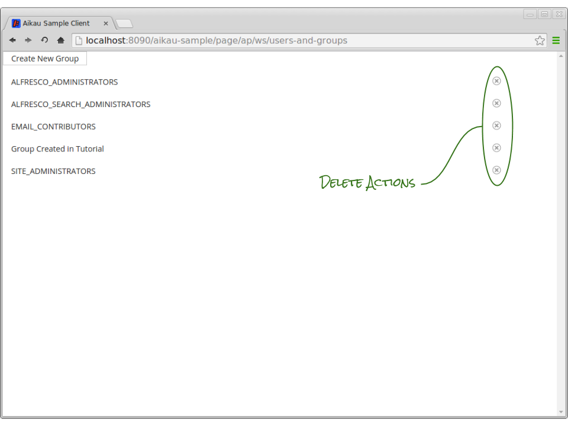

Previous: [Widget Dialogs](./Tutorial8.md),
Next: [Inline Editing Properties](./Tutorial10.md)

## Tutorial 9 - Actions in Lists

We can now create groups and add users to groups. It would also be nice if we could delete groups and remove users from groups. In this tutorial we’re going to introduce the `alfresco/renderers/PublishAction` which we’ll use to do just that.

### Step 1. Add a PublishAction widget
Let’s start by adding a new cell into the views for both lists. Add the following into the array of `widgets` in the `alfresco/lists/views/layouts/Row` configurations:

```JAVASCRIPT
{
   name: "alfresco/lists/views/layouts/Cell",
   config: {
      widgets: [
         {
            name: "alfresco/renderers/PublishAction",
            config: {
               iconClass: "delete-16"
            }
         }
      ]
   }
}
```

When you refresh the page you should see that each entry in the list now has a delete icon at the end of the row, but that clicking on it has no effect - this is because we haven’t defined a publish topic or payload yet.



When deleting a group it is possible to use the CrudService because we can use the variable substitution capabilities to construct the required URL. Update the `PublishAction` widget configuration in the groups list (e.g. not the list requested to appear in the dialog) to be this:

```JAVASCRIPT
{
  name: "alfresco/renderers/PublishAction",
  config: {
    iconClass: "delete-16",
    publishTopic: "ALF_CRUD_DELETE",
    publishPayloadType: "PROCESS",
    publishPayloadModifiers: ["processCurrentItemTokens"],
    publishPayload: {
      url: "api/groups/{shortName}"
    },
    publishGlobal: true
  }
}
```

Note that we’re now performing a DELETE HTTP request by using the “ALF_CRUD_DELETE” topic and that we are configuring the URL to include the group name through the use of the `processCurrentItemTokens` processor function.

Refreshing the page should now allow you to delete a group, however...

**IMPORTANT - Don’t delete the  “ALFRESCO_ADMINISTRATORS” group or you will break your Alfresco Repository!**

### Step 2. Add Confirmation Safeguard
For this reason we probably want to add some safeguards into our model to prevent accidental deletions. Fortunately the CrudService can help us out here. Update the `publishPayload` configuration to include the following extra attributes:

```JAVASCRIPT
publishPayload: {
   url: "api/groups/{shortName}",
   requiresConfirmation: true,
   confirmationTitle: "Delete {displayName}?",
   confirmationPrompt: "Are you sure you want to delete {displayName}?"
},
```

By including the `requiresConfirmation` attribute in the payload we are telling the CrudService to display a confirmation dialog to give the user the option to cancel the action before it’s too late. It’s worth taking a look at how the [CrudService does this](https://github.com/Alfresco/Aikau/blob/master/aikau/src/main/resources/alfresco/services/CrudService.js "Link to CrudService source file in GitHub") as it's a useful pattern to include in your own services where appropriate.

Refreshing the page and clicking on a delete action should now display a dialog similar to the one shown here:


The reason that we can’t use the CrudService for removing a user from a group is because the URL required contains both the group ID and the user short name and the attribute `shortName` is used in the response bodies for both listing groups and listing users in groups, e.g. the URL we would construct would look like this:

```JAVASCRIPT
api/groups/{shortName}/children/{shortName}
```

...it would be impossible to know which “shortName” attribute to use!

To work around this problem we’ll add a new handler into the `UserAndGroupService`. This allows us to configure our PublishAction as follows:

```JAVASCRIPT
{
  name: "alfresco/renderers/PublishAction",
  config: {
    iconClass: "delete-16",
    publishTopic: "TUTORIAL_REMOVE_USER_FROM_GROUP",
    publishPayload: {
      pubSubScope: "GROUP_USERS_",
      groupId: "{shortName}"
    },
    publishPayloadItemMixin: true,
    publishGlobal: true
  }
}
```

The important piece of configuration here is the `publishPayloadItemMixin` attribute which indicates that the publication payload should not only include the processed value, but that it should have the entire `currentItem` object mixed into it.

This means that when our service receives a request to remove a user, the group to remove the user from will be defined by the `groupId` attribute. 

**NOTE: It’s important to understand that this is set through the configuration of `alfresco/renderers/PropertyLink` and not through the configuration of the PublishAction.**

The user to remove from the group will be defined by the `shortName` attribute. Let’s add the function into the service to see this in action:

```JAVASCRIPT
removeUserFromGroup: function tutorial_UserAndGroupService__removeUserFromGroup(payload) {
  this.serviceXhr({
    url: AlfConstants.PROXY_URI + "api/groups/" + payload.groupId + "/children/" + payload.shortName,
    method: "DELETE",
    data: {
      pubSubScope: payload.pubSubScope
    },
    successCallback: this.onSuccess,
    callbackScope: this
  });
}
```

Don’t forget that we still need to update the constructor in our service to bind a subscription to the “TUTORIAL_REMOVE_USER_FROM_GROUP” topic to the `removeUserFromGroup` function, e.g:

```JAVASCRIPT
this.alfSubscribe("TUTORIAL_REMOVE_USER_FROM_GROUP", lang.hitch(this, "removeUserFromGroup"));
```

When you [clear the dependency caches](./ClearingDependencyCaches.md) and refresh the page you’ll see that you can remove previously added users from groups.


Previous: [Widget Dialogs](./Tutorial8.md),
Next: [Inline Editing Properties](./Tutorial10.md)
